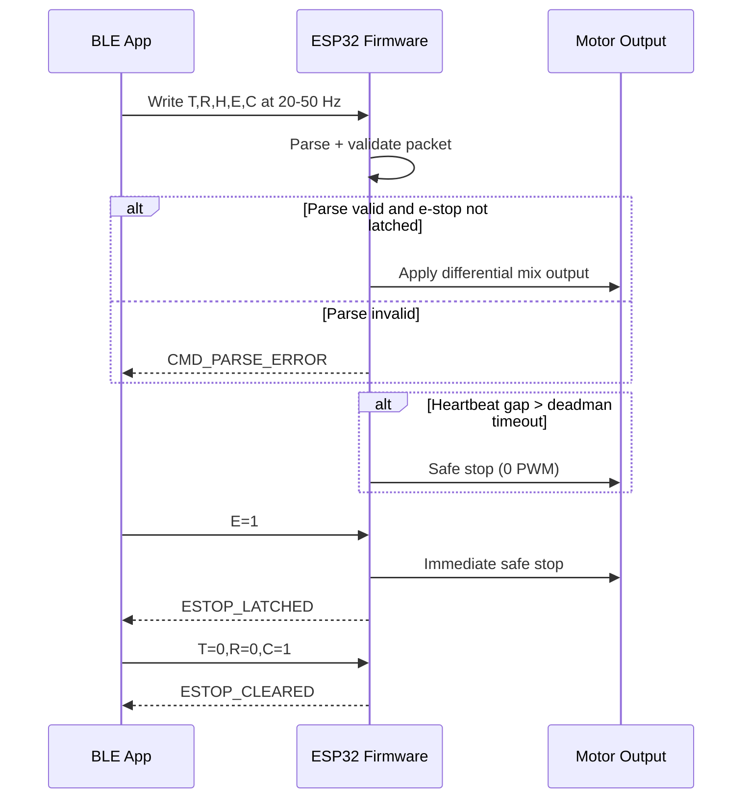

# BLE Control Profile (Stage 1 Baseline)

_Last updated: 2026-03-13_

This document defines the first-pass BLE command profile implemented by the Stage 1 ESP32 firmware baseline.

## Goals

- Keep control packets simple for quick phone-app testing.
- Support only Stage 1 manual teleop and safety commands.
- Be robust enough for bench bring-up and repeatable acceptance testing.

## BLE service and characteristics

- **Device name:** `rc-rover-stage1`
- **Service UUID:** `f0001000-0451-4000-b000-000000000000`
- **Command characteristic UUID (Write/Write No Response):** `f0001001-0451-4000-b000-000000000000`
- **Status characteristic UUID (Read/Notify):** `f0001002-0451-4000-b000-000000000000`

## Command packet format

Write ASCII command packets to the command characteristic.

Format:

`T:<throttle>,R:<turn>,H:<heartbeat>,E:<estop>,C:<estop_clear>`

Example packets:
- `T:0.00,R:0.00,H:101,E:0,C:0`
- `T:0.35,R:-0.10,H:102,E:0,C:0`
- `T:0.00,R:0.00,H:150,E:1,C:0` (latch e-stop)
- `T:0.00,R:0.00,H:151,E:0,C:1` (clear e-stop latch)

### Packet field definitions

| Field | Type | Range | Required | Meaning |
|---|---|---|---|---|
| `T` | float | `-1.0..+1.0` | Yes | Throttle command; sign controls forward/reverse |
| `R` | float | `-1.0..+1.0` | Yes | Turn command; mixed with throttle for differential drive |
| `H` | uint32 | monotonic | Yes | Heartbeat sequence counter |
| `E` | int/bool | `0` or `1` | Optional | `1` triggers e-stop latch |
| `C` | int/bool | `0` or `1` | Optional | `1` requests e-stop clear (only honored at zero throttle/turn) |

## Expected update rate

- **Target control update rate:** 20–50 Hz.
- **Deadman timeout in firmware:** 300 ms default.
- If command updates stop for more than timeout, motors are forced to stop.

## Status notifications

Firmware can report status strings over the notify characteristic and serial output:
- `BOOT`
- `IDLE_DISARMED`
- `BLE_CONNECTED`
- `BLE_DISCONNECTED`
- `CMD_PARSE_ERROR`
- `ESTOP_LATCHED`
- `ESTOP_CLEARED`

## Control/safety sequence

