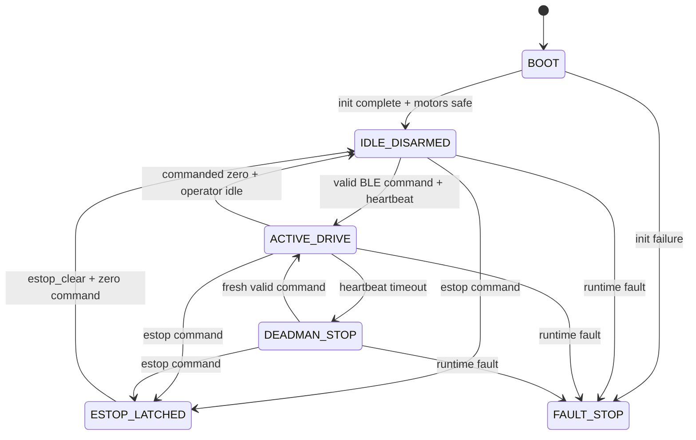

# Stage 1 Firmware Scaffold

_Last updated: 2026-03-12_

This scaffold defines the minimum firmware behavior required for Stage 1 bring-up on ESP32-DevKitC-32E.

## Scope

Included in Stage 1 firmware:
- BLE teleop command intake
- Differential drive motor mixing (throttle + turn)
- Deadman timeout safety behavior
- Explicit e-stop command behavior
- Battery ADC sampling and reporting
- Safe startup and fault handling

Out of scope:
- autonomy, camera/lidar, mapping, path planning, companion compute

## Suggested module layout (simple)

- `main.ino` or `main.cpp`
  - startup sequence
  - main control loop scheduling
- `ble_control.*`
  - parse BLE packets and update latest command
- `drive_mix.*`
  - throttle/turn mixing and clamping
- `motor_io.*`
  - pin init, PWM write, direction write, stop()
- `battery_adc.*`
  - ADC sample, scaling, low-voltage check
- `safety.*`
  - deadman timer, e-stop latch, fault state

## BLE teleop command model

Use a compact command packet at 20-50 Hz:

- `throttle`: float or int normalized to `[-1.0, +1.0]`
- `turn`: float or int normalized to `[-1.0, +1.0]`
- `heartbeat`: monotonic sequence or timestamp
- `estop`: boolean (edge-triggered)

Optional:
- `mode` (manual only in Stage 1)

If packet parse fails, ignore packet and keep last valid command until deadman timeout expires.

## Deadman timeout behavior

- Timeout target: 300 ms initial value.
- If no valid heartbeat within timeout window:
  - set both PWM outputs to 0 immediately
  - clear commanded throttle/turn to zero
  - keep BLE connected state but mark control as inactive
- Recovery: resume only after a fresh valid command packet.

## E-stop behavior

- `estop=true` command sets an e-stop latch.
- While latched:
  - force both motors off regardless of new throttle/turn packets
  - publish state message `ESTOP_LATCHED`
- Clear condition (simple for Stage 1): require explicit `estop_clear` command plus zeroed throttle/turn.

Physical main switch remains the hard stop for all cases.

## Differential drive mixing logic

Given normalized inputs:
- `left = clamp(throttle + turn, -1, +1)`
- `right = clamp(throttle - turn, -1, +1)`

Per side:
1. Direction pin = sign of command (forward/reverse).
2. PWM duty = `abs(command)` mapped to configured range.
3. Apply small PWM floor only after initial tuning (default floor = 0 for safest first bring-up).

## Battery ADC reporting flow

- Sample battery divider via GPIO34 on fixed interval (for example every 100 ms).
- Apply moving average (small window 4-8 samples).
- Convert ADC counts -> input voltage using divider ratio and calibration factor.
- Report over serial at 2-5 Hz during bring-up.
- If voltage below configured warning threshold:
  - keep driving allowed at reduced duty cap (optional)
  - emit warning flag in telemetry.

## Startup state

On boot:
1. Configure GPIO and PWM channels.
2. Force motor outputs to safe stop.
3. Initialize BLE service/characteristics.
4. Start battery ADC task.
5. Enter `IDLE_DISARMED` until first valid teleop command.

## Failure state behavior

Failure conditions include:
- invalid pin init
- motor output write failure (software detected)
- battery ADC out-of-range persistently

On failure:
- transition to `FAULT_STOP`
- command `motor_stop()` continuously
- publish fault code on serial and BLE status characteristic
- require reboot or explicit clear (implementation choice) before re-arm

## Control state diagram

