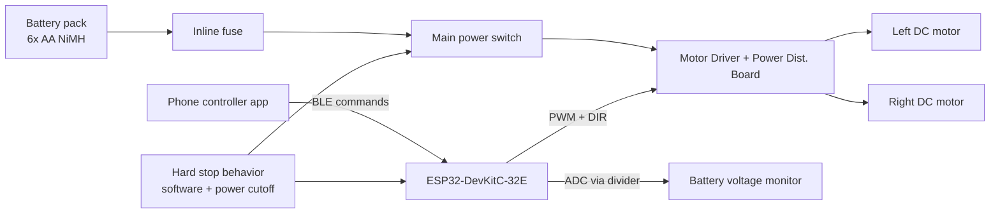

# Stage 1 Hardware Architecture

_Last updated: 2026-03-12_

This document freezes the Stage 1 hardware architecture for `rc-rover` so parts can be sourced and assembly can begin with low integration risk.

## Scope boundary (Stage 1)

Included:
- Differential-drive rover base
- ESP32 control board
- Dual motor-driver path
- Battery, fuse, switch, and basic power distribution
- Manual teleoperation and emergency stop behavior
- Basic battery voltage sensing

Explicitly excluded from Stage 1:
- Autonomous navigation
- Camera/lidar pipelines
- Companion Linux computer
- Advanced sensor fusion

## Frozen Stage 1 recommendations

1. **ESP32 board:** `Espressif ESP32-DevKitC-32E` (official DevKitC form factor)
2. **Motor driver path:** `Pololu Romi Motor Driver and Power Distribution Board` as primary integration path
3. **Initial manual control method:** **Bluetooth (BLE UART / BLE gamepad style)**

### Why these were chosen

- DevKitC-32E is widely documented, easy to source, and stable for bring-up with USB serial flashing.
- Romi-native motor-driver/power board reduces wiring complexity and mechanical integration risk in Stage 1.
- Bluetooth teleop keeps networking setup simple indoors, reduces latency surprises from Wi-Fi AP/client setup, and supports phone-based control without extra radio hardware.

## System block diagram

## Power architecture

- Main power path: battery -> fuse -> switch -> motor-driver/power board.
- Logic power: derived for ESP32 using stable regulated path (board USB during bench bring-up; onboard regulated feed for untethered operation).
- Shared ground between controller and motor driver is mandatory.

**Assumption:** For first build, AA NiMH pack current capability is sufficient for low-speed indoor testing and tuning.

## Control architecture

- ESP32 runs a minimal control loop:
  - receive teleop commands over BLE,
  - map throttle/turn to differential wheel commands,
  - enforce deadman timeout,
  - command motor driver PWM + direction,
  - report battery voltage over serial.

- Safety baseline:
  - deadman timeout (command heartbeat required),
  - explicit software stop command,
  - physical power cutoff switch accessible during test.

## Expansion points reserved now

- Encoder headers/routes reserved for Stage 3/4.
- Front sensor mount area reserved for ToF sensor.
- UART/I2C pins reserved for telemetry/sensor growth.

## Assumptions

- **Assumption:** The team can source either official or distributor-verified DevKitC-32E equivalent with matching pinout.
- **Assumption:** Stage 1 test environment is mostly flat indoor floors.
- **Assumption:** No high-current payloads are attached in Stage 1.
