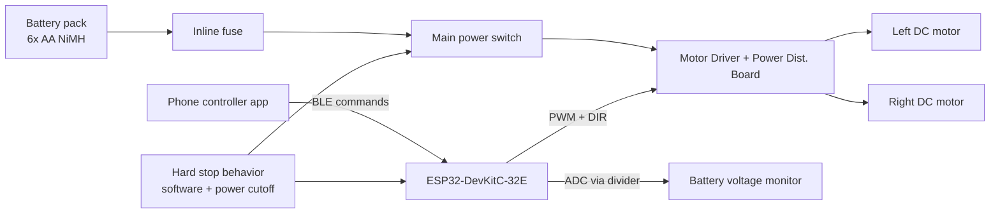
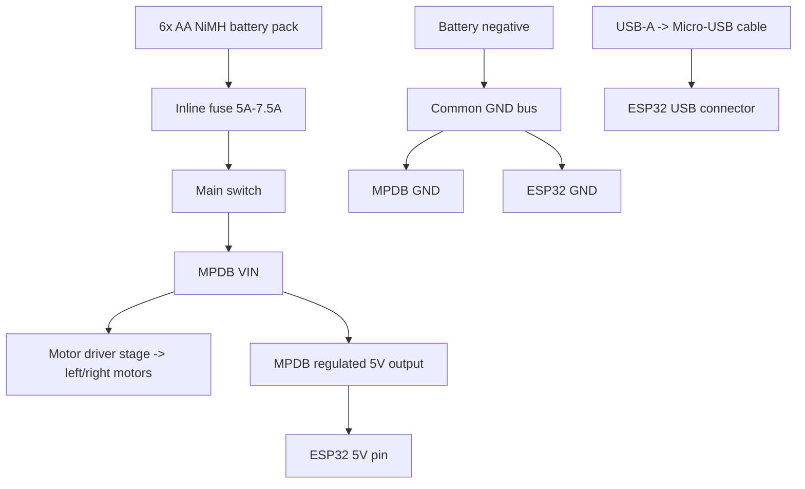

# Stage 1 Hardware Architecture

_Last updated: 2026-03-12_

This document freezes the Stage 1 hardware architecture for `rc-rover` so parts can be sourced and assembly can begin with low integration risk.

## Scope boundary (Stage 1)

Included:
- Differential-drive rover base
- ESP32 control board
- Romi motor-driver + power distribution board
- Battery, fuse, switch, and basic power distribution
- Manual teleoperation and emergency stop behavior
- Basic battery voltage sensing

Explicitly excluded from Stage 1:
- Autonomous navigation
- Camera/lidar pipelines
- Companion Linux computer
- Advanced sensor fusion

## Frozen Stage 1 recommendations

1. **ESP32 board:** `Espressif ESP32-DevKitC-32E` (official DevKitC form factor, Micro-USB)
2. **Motor driver path:** `Pololu Romi Motor Driver and Power Distribution Board` as primary integration path
3. **Initial manual control method:** **Bluetooth (BLE UART / BLE gamepad style)**

### Why these were chosen

- DevKitC-32E is widely documented, easy to source, and stable for bring-up with USB serial flashing.
- Romi-native motor-driver/power board reduces wiring complexity and mechanical integration risk in Stage 1.
- BLE teleop keeps networking setup simple indoors and avoids early Wi-Fi configuration complexity.

## System block diagram (functional)

## Power-flow diagram (explicit)

## ESP32 power mode definition (resolved)

### Bench USB bring-up

- ESP32 is powered by the laptop through **USB-A to Micro-USB** cable into the DevKitC-32E USB connector.
- Main battery path may be off during firmware flashing and BLE command validation.
- If motors are tested, the battery path can be enabled independently using the main switch.

### Untethered battery operation

- Battery path is `battery -> fuse -> main switch -> MPDB VIN`.
- ESP32 logic power is provided from **MPDB regulated 5V output -> ESP32 5V pin**.
- ESP32 GND must remain tied to MPDB/battery GND.
- USB is optional in this mode (debug only).

This removes previous logic-power ambiguity: untethered ESP32 power is explicitly sourced from the motor/power board regulated 5V rail.

## Control architecture

- ESP32 runs a minimal control loop:
  - receive teleop commands over BLE,
  - map throttle/turn to differential wheel commands,
  - enforce deadman timeout,
  - command motor driver PWM + direction,
  - report battery voltage over serial.

- Safety baseline:
  - deadman timeout (command heartbeat required),
  - explicit software stop command,
  - physical power cutoff switch accessible during test.

## Expansion points reserved now

- Encoder headers/routes reserved for Stage 3/4.
- Front sensor mount area reserved for ToF sensor.
- UART/I2C pins reserved for telemetry/sensor growth.

## Assumptions

- **Assumption:** MPDB regulated 5V output current capacity is sufficient for DevKitC-32E + Stage 1 logic load.
- **Assumption:** Stage 1 test environment is mostly flat indoor floors.
- **Assumption:** No high-current payloads are attached in Stage 1.
