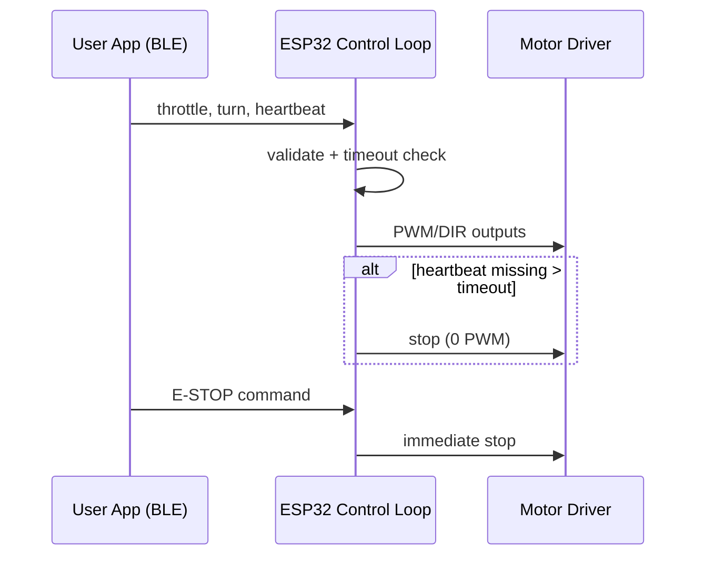

# Stage 1 Interface Map

_Last updated: 2026-03-12_

This document defines the electrical and logical interfaces for the Stage 1 freeze package.

## Interface summary table

| Interface | Source | Destination | Type | Stage 1 status | Notes |
|---|---|---|---|---|---|
| Power main | Battery pack | Motor driver/power board | DC power | Frozen | Routed through fuse + switch |
| Logic power (bench) | Laptop USB | ESP32 DevKitC-32E | 5V via Micro-USB | Frozen | USB-A to Micro-USB cable |
| Logic power (untethered) | Motor board regulated 5V | ESP32 5V pin | 5V rail | Frozen | Shared GND required |
| Motor control left | ESP32 GPIO25/GPIO26 | Motor driver | PWM + DIR | Frozen | GPIO25=PWM, GPIO26=DIR |
| Motor control right | ESP32 GPIO27/GPIO14 | Motor driver | PWM + DIR | Frozen | GPIO27=PWM, GPIO14=DIR |
| Battery sense | Voltage divider | ESP32 GPIO34 ADC1 | Analog | Frozen | Scale/calibrate in firmware |
| Manual teleop | Phone/controller | ESP32 | BLE | Frozen | Deadman timeout required |
| Debug/log | ESP32 | Laptop | USB serial | Frozen | For bring-up and validation |
| E-stop (soft) | Teleop app button | ESP32 loop | Command | Frozen | Immediate motor zero |
| E-stop (hard) | Human operator | Main switch | Physical | Frozen | Cuts system power |
| Optional status LED | ESP32 GPIO2 | LED | Digital out | Frozen | Optional only |
| Encoder inputs | Future encoder kit | ESP32 | Digital | Deferred | Reserved for Stage 3/4 |
| Front ToF sensor | Future sensor | ESP32 GPIO21/22 | I2C | Deferred | Planned Stage 3 |

## Pin freeze

See `docs/STAGE_1_PIN_MAP.md` for the canonical Stage 1 pin map and rationale.

## Command and safety interface

## Mechanical/electrical integration notes

- Keep high-current motor paths short and physically separated from ADC sensing wires.
- Use strain relief at battery and switch leads.
- Label polarity on all removable connectors.
- Route BLE antenna region clear of dense power wiring where possible.

## Assumptions

- **Assumption:** Stage 1 uses brushed DC motors bundled with the chosen differential-drive chassis.
- **Assumption:** BLE control app can provide recurring heartbeat packets at a stable interval.
