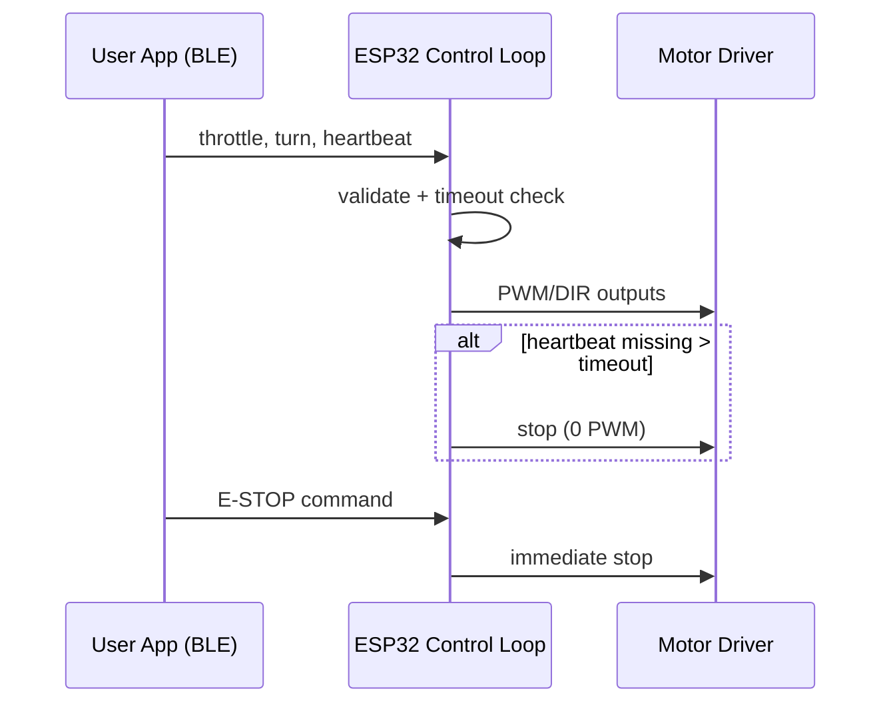

# Stage 1 Interface Map

_Last updated: 2026-03-12_

This document defines the electrical and logical interfaces for the Stage 1 freeze package.

## Interface summary table

| Interface | Source | Destination | Type | Stage 1 status | Notes |
|---|---|---|---|---|---|
| Power main | Battery pack | Motor driver/power board | DC power | Frozen | Routed through fuse + switch |
| Logic power | Regulated rail / USB | ESP32 DevKitC-32E | 5V/USB or 3.3V logic board rails | Frozen | USB allowed for bench tests |
| Motor control left | ESP32 GPIO | Motor driver | PWM + DIR | Frozen | Exact pins in firmware scaffold |
| Motor control right | ESP32 GPIO | Motor driver | PWM + DIR | Frozen | Exact pins in firmware scaffold |
| Battery sense | Voltage divider | ESP32 ADC pin | Analog | Frozen | Scale/calibrate in firmware |
| Manual teleop | Phone/controller | ESP32 | BLE | Frozen | Deadman timeout required |
| Debug/log | ESP32 | Laptop | USB serial | Frozen | For bring-up and validation |
| E-stop (soft) | Teleop app button | ESP32 loop | Command | Frozen | Immediate motor zero |
| E-stop (hard) | Human operator | Main switch | Physical | Frozen | Cuts system power |
| Encoder inputs | Future encoder kit | ESP32 | Digital | Deferred | Reserved for Stage 3/4 |
| Front ToF sensor | Future sensor | ESP32 I2C | I2C | Deferred | Planned Stage 3 |

## Pin-class allocation (board-agnostic first pass)

- 2x PWM-capable pins: left/right speed command
- 2x GPIO direction pins: left/right direction
- 1x ADC-capable pin: battery voltage sense
- 1x status LED pin (optional)
- 1x UART (USB native path for debug)
- 1x I2C pair reserved for future sensor

**Assumption:** Exact pin numbers may be finalized during firmware scaffold creation to avoid timer/ADC conflicts.

## Command and safety interface

## Mechanical/electrical integration notes

- Keep high-current motor paths short and physically separated from ADC sensing wires.
- Use strain relief at battery and switch leads.
- Label polarity on all removable connectors.
- Route BLE antenna region clear of dense power wiring where possible.

## Assumptions

- **Assumption:** Stage 1 uses brushed DC motors bundled with the chosen differential-drive chassis.
- **Assumption:** BLE control app can provide recurring heartbeat packets at a stable interval.
