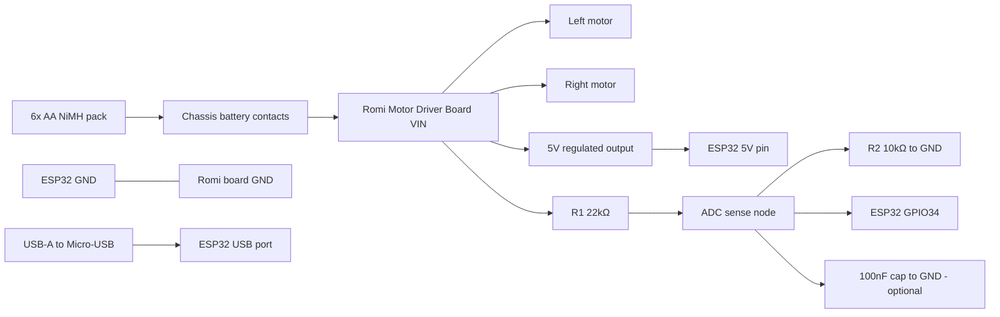
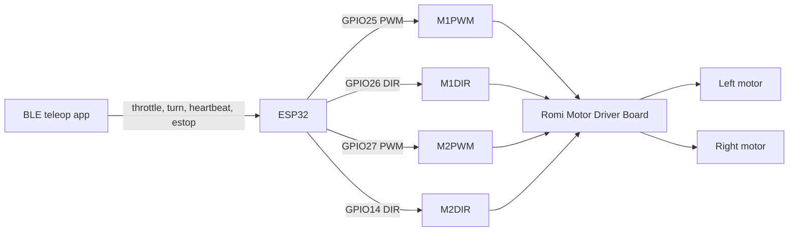

# Stage 1 Wiring and Pin Map

_Last updated: 2026-03-19_

This document freezes the Stage 1 wiring and ESP32 pin assignments for bench bring-up and untethered driving.

## Frozen pin assignments (ESP32-DevKitC-32E)

| Function | ESP32 pin | Direction | Notes |
|---|---|---|---|
| Left motor PWM | GPIO25 | Output | LEDC channel 0 |
| Left motor direction | GPIO26 | Output | Digital direction control |
| Right motor PWM | GPIO27 | Output | LEDC channel 1 |
| Right motor direction | GPIO14 | Output | **Boot-strapping pin — see note below** |
| Battery ADC sense | GPIO34 (ADC1_CH6) | Input | Input-only; battery divider sense |
| Optional status LED | GPIO2 | Output | Optional heartbeat/status blink |
| Reserved I2C SDA | GPIO21 | Bidirectional | Future Stage 3 sensor |
| Reserved I2C SCL | GPIO22 | Output/open-drain | Future Stage 3 sensor |

### Pin selection rationale

- GPIO25/27 have LEDC support and no boot-strapping risk.
- GPIO34 is ADC1 (not ADC2), avoiding Wi-Fi/BLE coexistence issues.
- GPIO14 accepted for direction output with LOW-init constraint (see below).
- Avoided UART0 pins (GPIO1/GPIO3) to preserve USB serial.
- GPIO33 is **not** used. An earlier draft incorrectly assigned it to M2DIR.

### GPIO14 boot-strapping notice

GPIO14 is sampled during reset to set SPI flash clock frequency.

**Safe in Stage 1** because the firmware initializes it LOW before any other operation, and the Romi M2DIR input presents a high-impedance load that does not pull the pin HIGH. **Do not add a pull-up resistor to this line.** If boot instability is observed, fallback is GPIO33 (update `config::PIN_RIGHT_DIR` and reflash). Log any change in `docs/DECISIONS.md`.

## Power and wiring path

## Control signal path

## Exact connection list

**Board-to-chassis (automatic — no manual wiring):**
- Romi Motor Driver Board snaps into chassis connector, connecting both motors and battery contacts.

**5 jumper wires (ESP32 → Romi board headers):**

| ESP32 | Romi board | Function |
|---|---|---|
| GPIO25 | M1PWM | Left motor speed |
| GPIO26 | M1DIR | Left motor direction |
| GPIO27 | M2PWM | Right motor speed |
| GPIO14 | M2DIR | Right motor direction |
| GND | GND | Shared ground (mandatory) |

**ESP32 logic power (untethered):**
- Romi board `5V` header → ESP32 `5V` pin.

**Battery voltage divider:**
- VIN tap → R1 (22kΩ) → ADC node → ESP32 GPIO34
- ADC node → R2 (10kΩ) → GND
- Optional: 100nF ceramic cap from ADC node to GND

**Bench power:** USB-A to Micro-USB from laptop → ESP32 USB connector.

## Battery voltage divider detail

Firmware constant: `BATTERY_DIVIDER_RATIO = 3.2f` (R1=22kΩ / R2=10kΩ as built; 20kΩ originally specified, 22kΩ substituted).

| Component | Value | Function |
|---|---|---|
| R1 | **22 kΩ** | Upper leg (battery → ADC node) |
| R2 | **10 kΩ** | Lower leg (ADC node → GND) |
| C1 | 100 nF ceramic (optional) | Noise filter |

**Verification at key voltages:**

| Battery state | Pack voltage | ADC pin voltage | Within 3.3V? |
|---|---|---|---|
| Fresh charge | 8.4V | 2.625V | ✓ |
| Nominal | 7.2V | 2.250V | ✓ |
| Low / stop | 6.0V | 1.875V | ✓ |

For calibration procedure, see `docs/STAGE_1_TUNING.md`.

## Continuity checklist (power off, no batteries)

- [ ] GPIO25 → M1PWM confirmed
- [ ] GPIO26 → M1DIR confirmed
- [ ] GPIO27 → M2PWM confirmed
- [ ] GPIO14 → M2DIR confirmed
- [ ] ESP32 GND → Romi GND confirmed
- [ ] Romi 5V → ESP32 5V pin confirmed
- [ ] No signal wire shorted to GND or another signal
- [ ] Divider chain: VIN tap → R1 → ADC node → R2 → GND confirmed
- [ ] ADC node → GPIO34 confirmed

## Polarity checklist

- [ ] Battery cells match chassis polarity markings
- [ ] Romi board 5V output verified before wiring to ESP32 5V pin
- [ ] USB cable is data-capable (not charge-only)
- [ ] Divider R2 connects to GND (not VIN)

## Pre-power inspection

- [ ] Wheels elevated for first motor test
- [ ] No exposed conductors can short against chassis
- [ ] All jumper wires clear of wheels
- [ ] BLE app ready
- [ ] Firmware boot state initializes outputs LOW
- [ ] Serial monitor ready (115200 baud)
- [ ] GPIO14 not pulled HIGH externally
