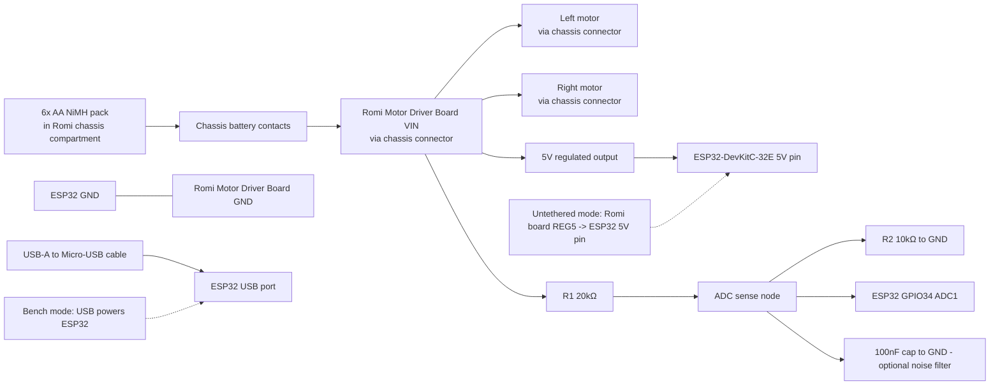
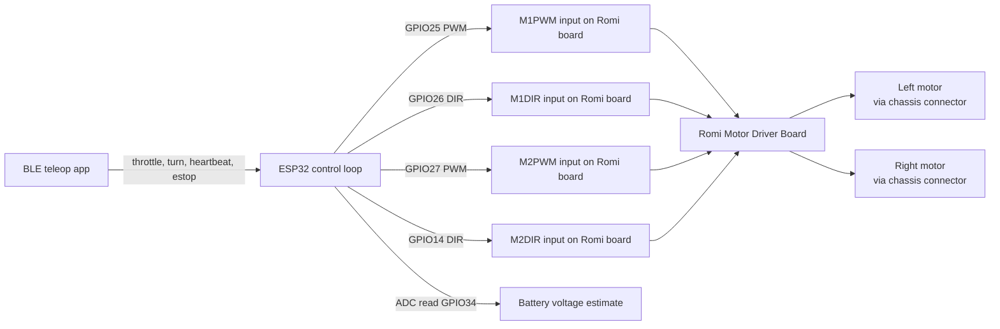

# Stage 1 Wiring Diagram

_Last updated: 2026-03-17_

This document freezes the exact Stage 1 wiring for first bench bring-up and untethered driving.

## Stage 1 power and wiring path

## Stage 1 control and signal path

## Exact connection list

**Board-to-chassis connections (no manual wiring required):**
1. Romi Motor Driver Board snaps into Romi chassis connector — this simultaneously connects left motor, right motor, and battery contacts. No separate motor or battery wires to run.

**Manual jumper wires (5 wires, ESP32 to Romi Motor Driver board headers):**
2. ESP32 GPIO25 → Romi board `M1PWM` header pin (left motor PWM).
3. ESP32 GPIO26 → Romi board `M1DIR` header pin (left motor direction).
4. ESP32 GPIO27 → Romi board `M2PWM` header pin (right motor PWM).
5. ESP32 GPIO14 → Romi board `M2DIR` header pin (right motor direction). See GPIO14 boot-strapping note in `STAGE_1_PIN_MAP.md`.
6. ESP32 any `GND` pin → Romi board `GND` header pin (shared logic ground — mandatory).

**ESP32 logic power (untethered operation):**
7. Romi board `5V` header pin → ESP32 `5V` pin.

**Battery voltage sense divider:**
8. Battery sense tap (from Romi board VIN-accessible point or chassis VIN node) → R1 (20kΩ) → ADC node.
9. ADC node → ESP32 GPIO34.
10. ADC node → R2 (10kΩ) → GND.
11. Optional: 100nF ceramic cap from ADC node to GND, placed close to the ESP32 pin.

**Bench power/debug cable:**
12. USB-A to Micro-USB cable from laptop → ESP32 USB connector (bench bring-up and firmware flashing).

## Battery voltage divider — resistor values and rationale

The firmware uses `BATTERY_DIVIDER_RATIO = 3.0`, meaning the ADC pin voltage equals one-third of the battery pack voltage.

**Required divider ratio derivation:**
- 6× AA NiMH cells: nominal 7.2V (6 × 1.2V), maximum ~8.4V freshly charged.
- ESP32 ADC input maximum: 3.3V.
- Minimum required step-down ratio to keep ADC within range: 8.4V / 3.3V = 2.55× minimum.
- Chosen ratio: 3.0× (provides comfortable margin and matches firmware constant).

**Resistor values for 3.0× ratio:**
The voltage divider output = Vin × R2 / (R1 + R2) = Vin × 1/3.
This requires R1 = 2 × R2.

| Component | Value | Function |
|---|---|---|
| R1 | **20 kΩ** | Upper divider leg (battery node to ADC node) |
| R2 | **10 kΩ** | Lower divider leg (ADC node to GND) |
| C1 | 100 nF ceramic (optional) | Noise filter cap from ADC node to GND |

**Verification at key battery voltages:**
| Battery state | Pack voltage | ADC pin voltage | Within 3.3V? |
|---|---|---|---|
| Fresh full charge | 8.4V | 2.80V | ✓ |
| Nominal | 7.2V | 2.40V | ✓ |
| Low / stop driving | 6.0V | 2.00V | ✓ |

**Calibration:** The firmware constant `BATTERY_CALIBRATION = 1.0f` is a correction multiplier. After hardware assembly, compare the serial-reported battery voltage to a multimeter reading across the pack. If they differ by a consistent factor, compute `correction = actual_voltage / reported_voltage` and update `BATTERY_CALIBRATION` in `firmware/stage1-esp32-baseline/src/main.cpp`. Record the calibration factor and measured values in `docs/STAGE_1_TUNING.md`. See the tuning doc for the step-by-step calibration procedure.

## Continuity checklist (power off, no batteries)

- [ ] Romi Motor Driver board is fully seated in chassis connector.
- [ ] ESP32 GPIO25 has continuity to Romi board M1PWM header pin.
- [ ] ESP32 GPIO26 has continuity to Romi board M1DIR header pin.
- [ ] ESP32 GPIO27 has continuity to Romi board M2PWM header pin.
- [ ] ESP32 GPIO14 has continuity to Romi board M2DIR header pin.
- [ ] ESP32 GND has continuity to Romi board GND header pin.
- [ ] No control wire signal pin has continuity to GND or to another signal pin.
- [ ] Divider chain continuity: VIN tap → R1 → ADC node → R2 → GND.
- [ ] ADC node has continuity to ESP32 GPIO34.

## Polarity checklist

- [ ] Battery cells installed with polarity matching the markings inside the Romi chassis compartment.
- [ ] Romi board 5V output orientation verified before wiring to ESP32 5V pin (check Romi board silk-screen label).
- [ ] USB cable is data-capable (charge+data, not charge-only) and Micro-USB end is at the ESP32.
- [ ] ADC divider lower leg (R2) connects to GND, not to VIN.

## Pre-power inspection checklist

- [ ] Wheels elevated for first powered motor test.
- [ ] No exposed conductor can short against chassis hardware or wheel hubs.
- [ ] All five control jumper wires are secure and clear of rotating wheels.
- [ ] BLE app ready with command characteristic identified.
- [ ] Firmware default boot state confirmed to initialize motor outputs LOW.
- [ ] Serial monitor prepared to observe battery ADC telemetry and state messages.
- [ ] GPIO14 direction wire is confirmed not pulled HIGH externally.
