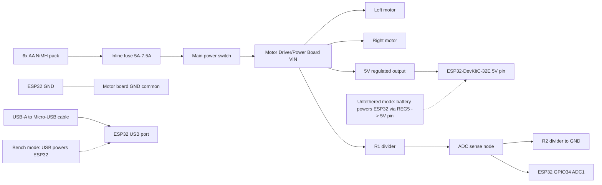
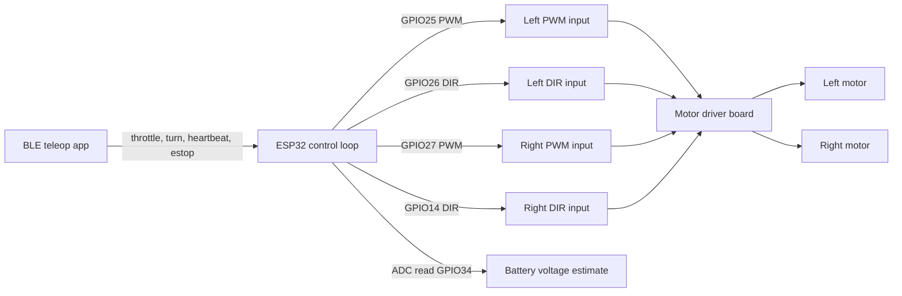

# Stage 1 Wiring Diagram

_Last updated: 2026-03-12_

This document freezes the exact Stage 1 wiring for first bench bring-up and untethered driving.

## Stage 1 power and wiring path

## Stage 1 control and signal path

## Exact connection list

1. Battery `+` -> inline fuse input.
2. Fuse output -> main switch input.
3. Main switch output -> motor board VIN.
4. Battery `-` -> motor board GND.
5. Motor board regulated `5V` -> ESP32 `5V` pin (untethered operation path).
6. Motor board GND -> ESP32 GND (shared logic/motor ground).
7. Left motor leads -> motor board left outputs (`M1A/M1B` equivalent).
8. Right motor leads -> motor board right outputs (`M2A/M2B` equivalent).
9. ESP32 GPIO25 -> left motor PWM input on motor board.
10. ESP32 GPIO26 -> left motor direction input on motor board.
11. ESP32 GPIO27 -> right motor PWM input on motor board.
12. ESP32 GPIO14 -> right motor direction input on motor board.
13. Battery sense divider top node from switched VIN -> R1 -> ADC node.
14. ADC node -> ESP32 GPIO34.
15. ADC node -> R2 -> GND.
16. Optional filter capacitor from ADC node to GND near ESP32.
17. USB-A to Micro-USB cable from laptop -> ESP32 USB connector for flashing/debug and bench power.

## Continuity checklist (power off)

- [ ] Battery `+` has continuity to fuse input only.
- [ ] Fuse output has continuity to switch input only.
- [ ] Switch output has continuity to motor board VIN only.
- [ ] Battery `-`, motor board GND, and ESP32 GND are common.
- [ ] No continuity between switched VIN and GND with switch OFF.
- [ ] Divider chain continuity: VIN -> R1 -> ADC node -> R2 -> GND.
- [ ] Left motor and right motor channels are not shorted together.

## Polarity checklist

- [ ] Battery polarity marked and verified before mate.
- [ ] VIN and GND to motor board not reversed.
- [ ] Motor board 5V output orientation verified before wiring ESP32 5V pin.
- [ ] USB cable is data-capable and connector orientation is correct (Micro-USB at ESP32).
- [ ] ADC divider lower leg returns to GND, not VIN.

## Pre-power inspection checklist

- [ ] Fuse installed and rated for initial low-speed testing (5A preferred start).
- [ ] Wheels elevated for first powered motor test.
- [ ] Main switch reachable by operator during test.
- [ ] No exposed conductor can short against chassis hardware.
- [ ] Motor wires secured away from rotating wheels.
- [ ] BLE app ready with deadman heartbeat enabled.
- [ ] Firmware default boot state confirmed to zero motor output.
- [ ] Serial monitor prepared to observe battery ADC and fault messages.

