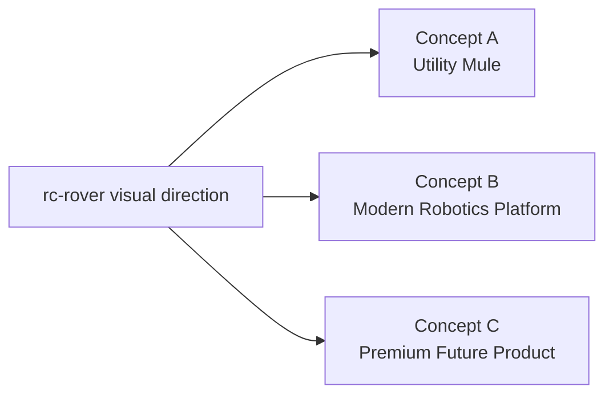
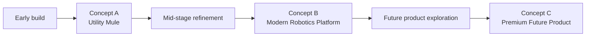

> **HISTORICAL REFERENCE:** This document contains early visual concept directions for `rc-rover`. It is not a canonical project state document. It is not linked from `docs/INDEX.md` as an active reference because it covers long-range aesthetic planning that is out of scope for Stage 1 execution. It is retained because the visual concept family map and render prompt starters may be useful in later phases (Stage 11+ per `docs/ROADMAP.md`). Do not treat this as a current deliverable or active task.

---

# rc-rover Concept Render Sheet

_Last updated: 2026-03-11_
_Status: **Historical reference — out of scope for Stage 1** — see docs/ROADMAP.md Stage 11 for when this becomes relevant_

This concept sheet defines the first visual directions for `rc-rover`. These are not final industrial designs. They are aesthetic and packaging directions meant to guide the future form of the rover once the mechanical architecture is frozen.

## Design goal

Create a rover that can eventually look:
- intentional
- modular
- technically credible
- visually distinct
- compatible with future sensor and payload growth

The underlying platform should still prioritize serviceability and experimentation.

---

## Visual family map

---

## Shared visual principles

All concept directions should preserve these qualities:
- low center of gravity
- clear front and rear identity
- visible purpose in the silhouette
- intentional sensor zones
- concealed or managed wiring
- modular mounting logic
- enough open access for maintenance

---

## Concept A - Utility Mule

### Personality
A straightforward engineering test platform with rugged proportions and visible functionality.

### Best for
- early prototype phases
- confidence during constant iteration
- easy service access
- "robotics mule" energy

### Color and material direction
- matte black
- dark gray
- occasional safety accent color
- textured printed parts
- simple metal brackets acceptable

### Strengths
- easiest to build honestly
- least likely to fight the hardware
- most realistic first prototype direction

---

## Concept B - Modern Robotics Platform

### Personality
A clean, contemporary rover that still feels modular and engineering-forward.

### Best for
- middle phases of the project
- documented builds
- visual clarity without pretending to be consumer-finished

### Color and material direction
- charcoal shell
- satin black chassis
- muted metallic accents
- one restrained highlight color

---

## Concept C - Premium Future Product

### Personality
A polished forward-looking rover that hints at a true future product family.

### Best for
- later concept rendering
- product exploration
- future branch storytelling

### Color and material direction
- satin graphite
- matte black lower structure
- smoked sensor window treatment
- premium accent metal or muted color trim

---

## Recommended visual strategy by phase

Use the concepts as a **sequence**, not as mutually exclusive identities:
- **Phase 1 to Phase 4:** borrow mainly from **Concept A**
- **Phase 5 to Phase 10:** migrate toward **Concept B**
- **Phase 11 onward:** explore **Concept C**

---

## Render prompt starters

### Concept A prompt starter
"A compact modular differential-drive robotics rover prototype with exposed functional structure, low stance, large wheels, visible electronics deck, front sensor mount, matte black and dark gray materials, rugged engineering-test-platform aesthetic, realistic workshop render."

### Concept B prompt starter
"A sleek modular ground rover with differential drive, low planted stance, integrated front sensor pod, clean electronics housing, satin charcoal and black finish, modern robotics platform aesthetic, realistic industrial design concept render."

### Concept C prompt starter
"A premium future-product robotics rover with smooth integrated shell, hidden fasteners, dark graphite and matte black materials, smoked sensor window, refined modern robotics aesthetic, highly polished industrial design concept render."
