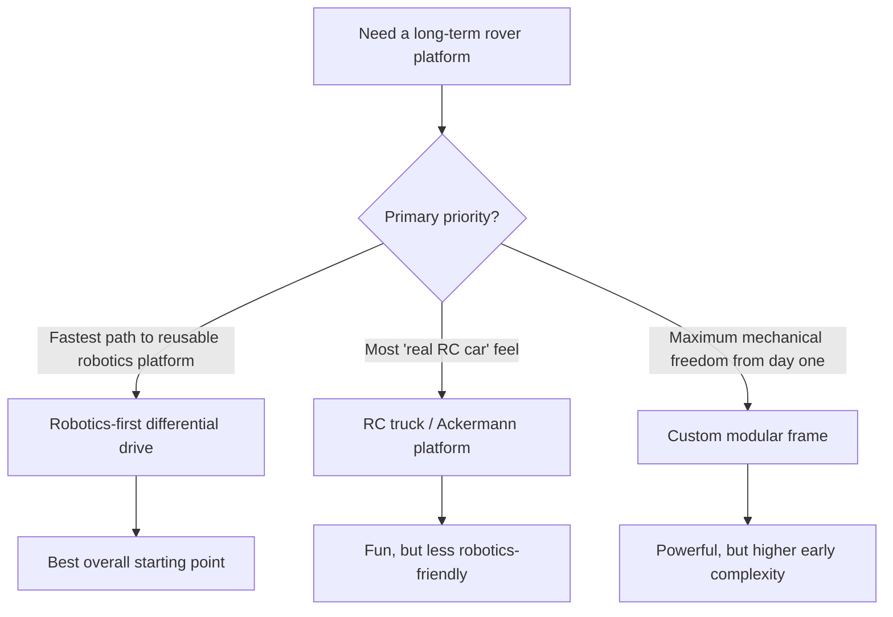
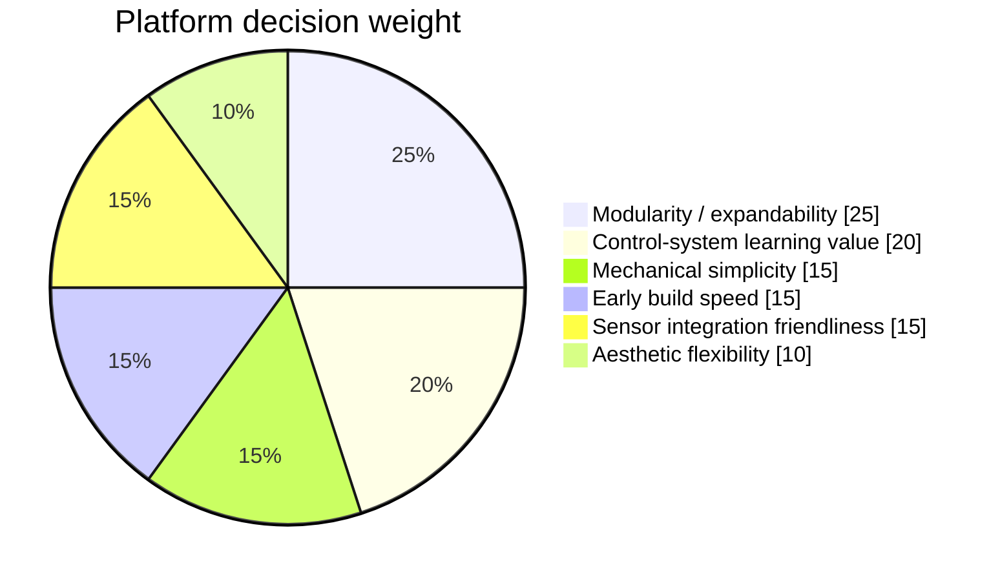

> **SUPERSEDED:** This document is an earlier platform decision analysis that has been superseded by `docs/PLATFORM_SELECTION.md`. The canonical platform decision record is `docs/PLATFORM_SELECTION.md` and `docs/DECISIONS.md`. This file is retained for historical reference and its weighted scoring matrix. Do not use it as the authoritative platform decision.

---

# rc-rover Platform Decision Matrix

_Last updated: 2026-03-11_
_Status: **Superseded by docs/PLATFORM_SELECTION.md** — retained for historical reference only_

This document compares the most credible base-platform directions for `rc-rover` and recommends the best starting point for a long-lived learning platform.

## Decision objective

Pick a base platform that:
- is realistic to build early
- supports long-term reuse
- teaches the right skills
- does not become a dead-end chassis

## Option set

The three most credible starting directions are:

1. **Robotics-first differential drive**
2. **RC truck / Ackermann steering platform**
3. **Custom modular frame**

---

## Visual summary

---

## Recommendation

**Recommended starting point: Robotics-first differential drive**

Why this wins:
- easiest path into encoders, IMU, telemetry, and control loops
- easiest path into future semi-autonomy
- best platform reuse across many future experiments
- least likely to trap the project inside car-specific geometry

---

## Weighted decision criteria

### Criteria and weights

### Scoring scale
- **5** = excellent
- **4** = strong
- **3** = acceptable
- **2** = weak
- **1** = poor

## Score table

| Criteria | Weight | Differential drive | RC truck / Ackermann | Custom modular frame |
|---|---:|---:|---:|---:|
| Modularity / expandability | 25 | 5 | 3 | 5 |
| Control-system learning value | 20 | 5 | 3 | 5 |
| Mechanical simplicity | 15 | 4 | 4 | 2 |
| Early build speed | 15 | 4 | 5 | 2 |
| Sensor integration friendliness | 15 | 5 | 3 | 5 |
| Aesthetic flexibility | 10 | 4 | 4 | 5 |

## Weighted result

| Option | Weighted score |
|---|---:|
| Differential drive | 4.55 |
| RC truck / Ackermann | 3.65 |
| Custom modular frame | 4.00 |

---

## Final recommendation

**Proceed with a robotics-first differential-drive platform.**

It is the best balance of:
- early buildability
- control-systems learning
- sensor integration
- long-term expandability
- future product exploration
