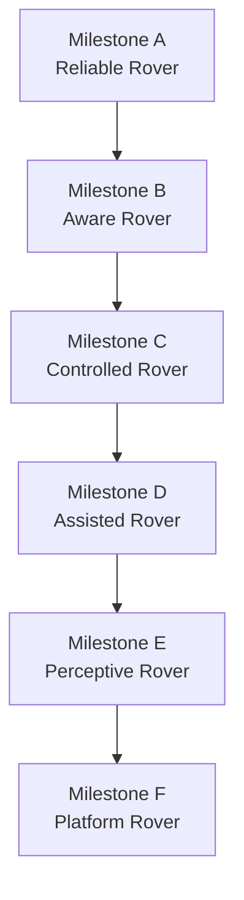
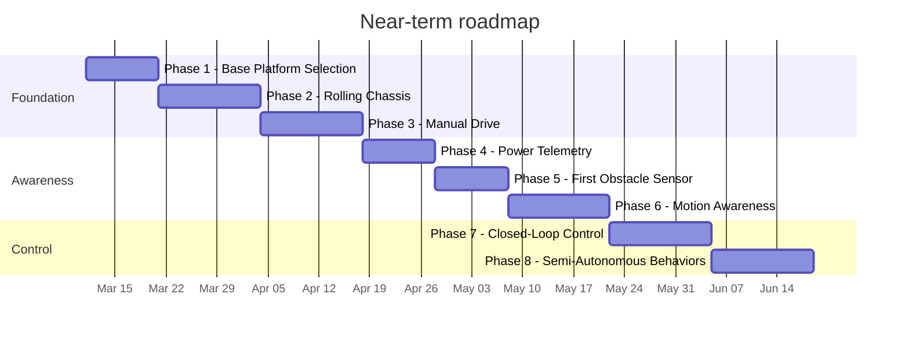

> **SUPERSEDED:** This document is an earlier roadmap draft that has been superseded by `docs/ROADMAP.md`. The canonical roadmap is `docs/ROADMAP.md`. This file is retained for historical reference only. Do not use it as a source of truth for project phase, platform generation, or next actions.

---

# rc-rover Roadmap

_Last updated: 2026-03-11_
_Status: **Superseded by docs/ROADMAP.md** — retained for historical reference only_

This roadmap defines how `rc-rover` will grow from a simple manually controlled ground vehicle into a reusable robotics development platform. The project is intentionally staged so that each phase leaves behind a working machine, a clearer understanding of the system, and a documented foundation for the next step.

## North star

Build a modular rover platform that starts simple and grows over time into a capable learning and experimentation mule for:

- remote control
- power systems
- telemetry
- sensors
- motion estimation
- closed-loop control
- semi-autonomy
- advanced perception
- modular payloads
- refined industrial design

## Core roadmap rules

1. Every phase must leave behind a usable platform.
2. Each phase should have one primary learning objective.
3. The rover should evolve through upgrades, not repeated ground-up rebuilds.
4. Sensors should eventually influence behavior, not just produce data.
5. Architecture comes before aesthetics, but aesthetics should not be ignored forever.
6. If a concept can be tested cheaply and early, test it before overcommitting.

---

## Visual overview

```mermaid
flowchart LR
    A["Phase 0<br/>Project Operating System"] --> B["Phase 1<br/>Base Platform Selection"]
    B --> C["Phase 2<br/>Rolling Chassis"]
    C --> D["Phase 3<br/>Manual Drive"]
    D --> E["Phase 4<br/>Power Telemetry"]
    E --> F["Phase 5<br/>First Obstacle Sensor"]
    F --> G["Phase 6<br/>Motion Awareness"]
    G --> H["Phase 7<br/>Closed-Loop Control"]
    H --> I["Phase 8<br/>Semi-Autonomous Behaviors"]
    I --> J["Phase 9<br/>Advanced Perception"]
    J --> K["Phase 10<br/>Compute Upgrade"]
    K --> L["Phase 11<br/>Aesthetic Refinement"]
    L --> M["Phase 12<br/>Payload Ecosystem"]
    M --> N["Phase 13<br/>Productization Experiments"]
```

---

## Milestone ladder

### Milestone meanings

- **Milestone A - Reliable Rover**  
  The rover drives manually, stops safely, survives repeated tests, and has documented wiring and power setup.

- **Milestone B - Aware Rover**  
  The rover can report battery state and react to a simple obstacle sensor.

- **Milestone C - Controlled Rover**  
  The rover understands its own motion and can use feedback for better control.

- **Milestone D - Assisted Rover**  
  The rover can perform limited semi-autonomous behaviors safely and repeatably.

- **Milestone E - Perceptive Rover**  
  The rover can use richer sensing such as lidar or camera systems in meaningful ways.

- **Milestone F - Platform Rover**  
  The rover becomes a reusable robotics base with cleaner packaging, modular payloads, and possible product branches.

---

## Near-term sequence

This timeline is directional, not a fixed commitment. The project should move forward only when exit criteria are actually met.

---

## How to use this roadmap

Use this file for strategic direction, not as a daily task list.

For active execution:
- use `docs/NEXT_STEPS.md` for the action queue
- use `docs/PROJECT_STATE.md` for current status
- use `docs/DECISIONS.md` for committed decisions
- use `docs/HANDOFF.md` for fast session recovery

When the project changes direction materially, update this roadmap and record the reason in `docs/DECISIONS.md`.
