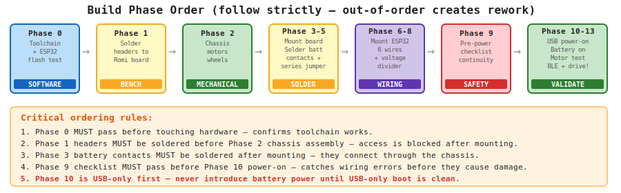
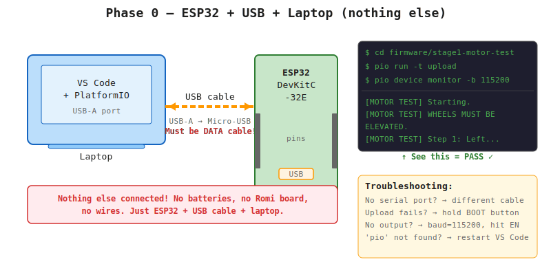
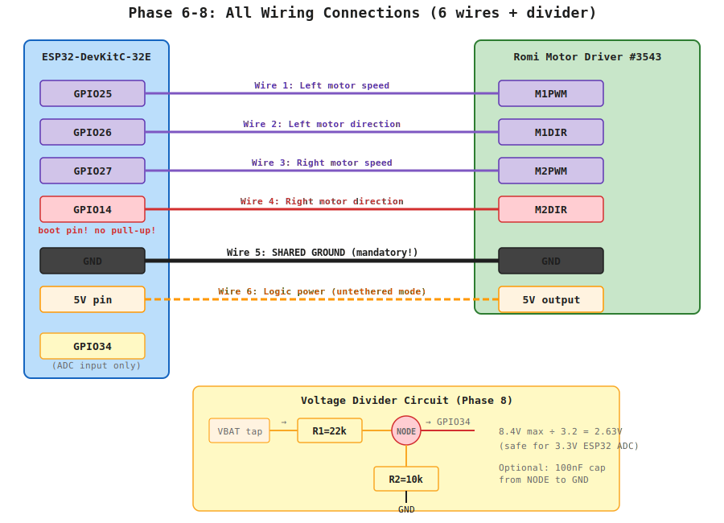

# Stage 1 Rover A — Physical Build Guide

_Last updated: 2026-03-20_

> **Board notice:** This guide targets the **Pololu Romi Motor Driver and Power Distribution Board (#3543)** exclusively. If you have any version of this guide that mentions `AIN1`, `AIN2`, `BIN1`, `BIN2`, `OUT1`–`OUT4`, or GPIO33 for M2DIR, discard it and use this file only.

---

# 1. Build Overview

## Objective

Build Rover A Stage 1 as a safe, working, manually controlled differential-drive rover using:
- Romi chassis kit (Pololu #3506, blue)
- Pololu Romi Motor Driver and Power Distribution Board (#3543)
- ESP32-DevKitC-32E
- 6× AA NiMH cells

## What you are building

One motor drives the left wheel, one motor drives the right wheel. The Romi Motor Driver board sits on the chassis, drives both motors, and supplies regulated 5V logic power to the ESP32. The ESP32 sends PWM and direction signals to the motor driver board via jumper wires.

## Key facts about the Romi Motor Driver board

Before you start, understand what this board does and does not do automatically:

- **Motors connect through the chassis** — the board has female headers that mate with the motor tabs when pressed into the chassis. No separate motor wire routing needed, but the headers must be **soldered to the board first** (before mounting).
- **Battery contacts must be soldered** — after the board is mounted, you solder the four battery terminal tabs to the board to establish the electrical and mechanical connection.
- **6-cell series jumper required** — the Romi battery compartment is split into a 4-cell section and a 2-cell section. A short jumper wire must be soldered to connect them in series for full 7.2V nominal.
- **The board has a built-in latching power button** — one press turns power on, another turns it off. This is your primary power switch. Your SPST toggle switch can be wired externally in parallel as an additional cutoff, but the board's built-in button handles normal operation.
- **Control signals need 5 jumper wires** — from ESP32 GPIO pins to the board's control header pins.
- **Regulated 5V output** on the board powers the ESP32 in untethered operation.

## Correct build order

The build must follow this sequence. Doing steps out of order creates rework:

1. Toolchain setup and ESP32 verification
2. Solder headers and motor connectors to the Romi board **on the bench** before mounting
3. Mechanical chassis assembly
4. Mount board into chassis; solder battery contacts
5. Solder 6-cell series jumper
6. Mount and secure ESP32
7. Wire ESP32 control signals to Romi board
8. Wire ESP32 logic power from Romi board
9. Build battery voltage divider
10. Pre-power checklist
11. First power-on (USB only)
12. First battery power-on
13. Motor direction verification and production firmware flash
14. Drive validation

### Build phase overview



### Visual references — keep these open during the build

These Pololu pages have step-by-step photos of the actual parts you're working with. Open them in separate browser tabs and reference them alongside these instructions:

- **Romi Chassis Assembly Guide (photos of every step):** [pololu.com/docs/0J68/4](https://www.pololu.com/docs/0J68/4) — battery contacts, motor clips, wheels, ball caster
- **Romi Chassis Power Options (series jumper photo):** [pololu.com/docs/0J68/all#5](https://www.pololu.com/docs/0J68/all) — scroll to Section 5 for the battery wiring diagram and series jumper photo
- **Motor Driver Board Product Page (board photos + pin descriptions):** [pololu.com/product/3543](https://www.pololu.com/product/3543) — scroll to "Using the board" for installation photos, pin layout diagram, and motor driver descriptions

---

# 2. System Architecture

Three paths must all be correct:

**Power path:** Battery cells → chassis contacts (soldered to Romi board) → Romi motor drivers → motors. Also: Romi board regulated 5V → ESP32 5V pin.

**Control path:** ESP32 GPIO pins → jumper wires → Romi board control headers → motor driver ICs → motors.

**Ground path (critical):** ESP32 GND and Romi board GND must share a jumper wire. Without this, control signals will not work.

---

# 3. Tools Required

**Mandatory:**
- Soldering iron with temperature control (650–720°F / 340–380°C for battery contacts; 600–650°F / 315–340°C for headers)
- Rosin-core solder, 60/40 or 63/37, 0.6–0.8mm diameter
- Tip cleaner (brass wool preferred)
- Small Phillips screwdriver
- Wire stripper
- Multimeter

**Helpful:**
- Helping hands or PCB holder
- Flush cutters
- Heat-resistant mat

---

# 4. Parts Identification

**Romi chassis kit (#3506, blue)**
- Main blue chassis plate with integrated 6× AA battery compartment (split 4+2 sections)
- Two DC gear motors with wire leads
- Two drive wheels
- Ball caster assembly
- Hardware bag
- Four individual battery contact terminals (spring type)
- Two double-sided battery contacts (long cross-shaped, bridge the sections)

**Pololu Romi Motor Driver and Power Distribution Board (#3543)**
- Compact PCB with white chassis connector on underside
- Built-in latching power button (small tactile button)
- Two low-profile female headers included in packaging (for motor connections)
- Control header holes: M1PWM, M1DIR, M2PWM, M2DIR, GND, 5V

**Consumables needed:**
- Male 0.1" pin headers for control signal headers (check if any shipped with the board)
- Short wire ~5cm for 6-cell series jumper
- 5× Dupont jumper wires
- R1: 22kΩ resistor
- R2: 10kΩ resistor
- 100nF ceramic capacitor (optional noise filter)
- Small perfboard or mini breadboard for voltage divider

---

# 5. PHASED BUILD INSTRUCTIONS

---

## PHASE 0 — Toolchain Setup and ESP32 Verification

### Goal
Confirm the ESP32 flashes and your development tools work before any hardware assembly. This eliminates an entire class of "is it my code or my wiring?" confusion later.



### What you need for this phase
- ESP32-DevKitC-32E board (nothing else connected to it)
- USB-A to Micro-USB cable (**must be a data cable**, not charge-only — if you can't tell, try it and check for a serial port)
- Laptop with internet access

### Step 1: Install PlatformIO

1. Download and install [Visual Studio Code](https://code.visualstudio.com/) if you don't already have it.
2. Open VS Code.
3. Click the **Extensions** icon in the left sidebar (looks like 4 squares).
4. In the search box, type `PlatformIO IDE`.
5. Click **Install** on the PlatformIO IDE extension.
6. Wait for installation to complete — a PlatformIO icon (alien head) appears in the left sidebar.
7. **Restart VS Code** (close and reopen). This is required for PlatformIO to finish setup.

### Step 2: Connect the ESP32

1. **Do not connect anything else to the ESP32.** No batteries, no Romi board, no jumper wires. Just the bare board.
2. Plug the **Micro-USB** end of the cable into the ESP32 board's USB port (bottom edge of the board).
3. Plug the **USB-A** end into your laptop.
4. The ESP32 power LED should light up (red or blue depending on board variant).

### Step 3: Confirm the serial port appears

**Windows:**
- Open Device Manager → expand "Ports (COM & LPT)".
- You should see "Silicon Labs CP210x" or "CH340" with a COM number (e.g., COM3).
- If nothing appears: try a different USB cable, or install the [CP2102 driver](https://www.silabs.com/developers/usb-to-uart-bridge-vcp-drivers).

**Mac:**
- Open Terminal and run: `ls /dev/tty.usbserial*` or `ls /dev/tty.SLAB*`
- You should see a device like `/dev/tty.usbserial-0001` or `/dev/tty.SLAB_USBtoUART`.
- If nothing appears: install the [CP2102 driver from Silicon Labs](https://www.silabs.com/developers/usb-to-uart-bridge-vcp-drivers), then restart your Mac.

**Linux:**
- Open Terminal and run: `ls /dev/ttyUSB*`
- You should see `/dev/ttyUSB0` or similar.
- If permission denied: `sudo usermod -a -G dialout $USER` then log out and back in.

### Step 4: Compile the motor test sketch

Open a terminal (VS Code: Terminal → New Terminal, or use PlatformIO's built-in terminal) and run:

```bash
cd firmware/stage1-motor-test
pio run
```

**First run will take about 5 minutes** — PlatformIO downloads the ESP32 toolchain, Arduino framework, and BLE libraries. Subsequent builds are fast (~10 seconds).

You should see output ending with:
```
Building .pio/build/esp32dev/firmware.bin
===== [SUCCESS] Took X.XX seconds =====
```

If it fails: check that PlatformIO is fully installed (restart VS Code if needed).

### Step 5: Flash the ESP32

```bash
pio run -t upload
```

You should see:
```
Connecting........_____
Chip is ESP32-D0WD-V3
Uploading stub...
Writing at 0x00010000... (XX%)
Hard resetting via RTS pin...
===== [SUCCESS] Took X.XX seconds =====
```

**If it says "Connecting........_____" and hangs:**
- Hold the **BOOT** button on the ESP32 board (small button, usually labeled BOOT or GPIO0).
- While holding it, click upload again (or press the **EN** button once while still holding BOOT).
- Release BOOT after you see "Connecting..." succeed.
- Some boards need this every upload; some don't.

### Step 6: Open the serial monitor

```bash
pio device monitor -b 115200
```

You should see:
```
========================================
[MOTOR TEST] Starting.
[MOTOR TEST] WHEELS MUST BE ELEVATED.
[MOTOR TEST] Watch each wheel for correct spin direction.
[MOTOR TEST] Note any reversed directions below:
  Expected: DIR HIGH = forward (away from caster end)
  If reversed: correct writeSide() in stage1-esp32-baseline main.cpp
========================================
[MOTOR TEST] Step 1: Left motor FORWARD (right wheel should be still)
[MOTOR TEST] STOP
[MOTOR TEST] Step 2: Left motor REVERSE (right wheel should be still)
[MOTOR TEST] STOP
... (continues through 8 steps)
[MOTOR TEST] Sequence complete.
```

**Motors will not move** — there is no motor power connected. This only confirms the firmware is running.

**If you see garbled text:** baud rate mismatch. Make sure the monitor uses 115200. Exit with `Ctrl+C` and retry.

**If you see nothing:** press the **EN** (reset) button on the ESP32 board. The test sequence runs once at boot.

### Step 7: Verify you can also compile the production firmware

```bash
cd ../stage1-esp32-baseline
pio run
```

Don't flash it yet — just confirm it compiles. You'll flash this after motor direction validation in Phase 12.

### Phase 0 completion criteria

- [ ] PlatformIO installed and VS Code recognizes it
- [ ] ESP32 serial port visible on your computer
- [ ] Motor test sketch compiles and uploads successfully
- [ ] Serial monitor shows the full 8-step test sequence
- [ ] Production firmware compiles successfully (not flashed yet)

**All five boxes checked? Phase 0 is complete. Move to Phase 1.**

### Phase 0 troubleshooting reference

| Symptom | Likely cause | Fix |
|---|---|---|
| No serial port appears | Charge-only USB cable | Try a different cable — data cables are slightly thicker |
| No serial port appears | Missing USB driver | Install CP2102 driver from Silicon Labs |
| Upload hangs at "Connecting..." | ESP32 not entering bootloader | Hold BOOT button during upload |
| Compile error "board not found" | PlatformIO not fully installed | Restart VS Code, wait for PlatformIO setup |
| Garbled serial output | Wrong baud rate | Ensure 115200 in monitor command |
| No serial output at all | ESP32 not running | Press EN (reset) button |
| `pio` command not found | PlatformIO not in PATH | Use PlatformIO terminal inside VS Code instead |

---

## PHASE 1 — Solder Romi Motor Driver Board (BENCH — before chassis assembly)

### Goal
Complete all soldering to the Romi board while it is off the chassis. Access is much better now than after mounting.

> **📷 Photo reference:** See the [Motor Driver Board product page](https://www.pololu.com/product/3543) — scroll to "Using the board > Installation" for photos of the board with headers installed, and the board mounted on a chassis. The first photo shows the board with included hardware laid out. The second photo shows it mounted on a chassis before motors are installed.

### What to solder

**A. Motor connection female headers**
The board ships with two low-profile female headers. These allow the motor tabs to plug in automatically when the board seats into the chassis.

1. Insert the female headers into the motor connection holes on the front edge of the board (the two sets of holes positioned over where the motors will sit).
2. Solder from the bottom side. Tack one pin first, check alignment, then solder the rest.
3. Temperature: 650°F / 340°C.
4. Inspect: headers should be flush and perpendicular.

**B. Control signal male headers**
Solder a row of male 0.1" header pins into the control signal holes so Dupont jumper wires can connect.
You need at minimum: M1PWM, M1DIR, M2PWM, M2DIR, GND, 5V.

1. Insert male pins from the top side.
2. Use a spare breadboard to hold pins perpendicular while soldering.
3. Solder from the bottom side.
4. Temperature: 620°F / 325°C.

### Soldering reminders
- Tin the tip before starting. Wipe on brass wool, add a tiny bit of fresh solder to the tip.
- Heat pad and pin together 1–2 seconds, then feed solder to the joint (not the iron).
- A good joint is shiny and volcano-shaped. A cold joint is dull and blobby.
- 2–3 seconds per joint max.

### What NOT to solder yet
Do not solder the battery contacts — those are done after mounting.

### Stop condition
Stop Phase 1 only when both motor female headers and all control signal male headers are soldered and visually inspected.

---

## PHASE 2 — Mechanical Chassis Assembly

### Goal
Build a straight, freely rolling chassis before adding electronics.

> **📷 Photo reference:** Follow along with the [Romi Chassis Assembly Guide](https://www.pololu.com/docs/0J68/4) — it has photos of each step: battery contacts going in from the underside (step 1) and top (step 2), motor clips pressing into place (step 4), and wheels snapping onto shafts.

### Steps
1. Place chassis flat with battery compartment facing up.
2. Install ball caster in the rear mounting hole. Snug, not over-tightened.
3. Insert the two double-sided battery contacts into the battery compartment channels from the underside.
4. Place the four individual battery contact terminals into the battery box from the top. They should rest loosely in their slots — they will be soldered later.
5. Press left motor into its motor clip until it clicks and is secure.
6. Press right motor into its motor clip until it clicks.
7. Snap left wheel onto left motor shaft (align the D-flat first).
8. Snap right wheel onto right motor shaft.
9. Roll rover forward and backward by hand. Check for binding.

### Stop condition
Rover rolls freely with no scraping or binding.

---

## PHASE 3 — Mount Romi Motor Driver Board and Solder Battery Contacts

### Goal
Mount the prepared Romi board and complete the battery contact soldering.

> **📷 Photo reference:** The [Romi Chassis Assembly Guide](https://www.pololu.com/docs/0J68/4) step 3 shows a board being pressed onto the chassis connector. The [Motor Driver Board product page](https://www.pololu.com/product/3543) "Installation" section has a photo of the motor driver board mounted on the chassis. The battery contacts are the same process shown in the chassis guide — your board is smaller than the one pictured, but the battery contact soldering is identical.

### Mount the board
1. Confirm no batteries are installed.
2. Orient the Romi Motor Driver board with the underside connector aligned to the chassis connector.
3. Press the board down firmly and evenly until fully seated. The motor tabs will engage the female headers from Phase 1.
4. Secure with the included #2-56 screws and nuts (two screws, front corners of the board).

### Solder the battery contacts
5. The four battery contact terminals are now accessible through the board's battery contact slots.
6. Apply iron to each terminal tab and pad together for 1.5–2 seconds, then feed solder.
7. Temperature: 680–720°F / 360–380°C — these joints need more heat due to thermal mass.
8. Work quickly — prolonged heat near the battery compartment plastic can deform the chassis.
9. Inspect each joint. Should be solid and shiny.

### Stop condition
Board mounted securely, all four battery contacts soldered.

---

## PHASE 4 — Solder 6-Cell Series Jumper

### Goal
Connect the two battery sections in series for full 6-cell (7.2V nominal) power.

> **📷 Photo reference:** The [Romi Chassis Power Options](https://www.pololu.com/docs/0J68/all) Section 5 has a diagram showing the two battery sections and a photo of the series jumper wire soldered between them. Scroll down to "Another option is to use all six batteries in series" — that's exactly what you're doing here. For the Motor Driver board specifically, the [product page](https://www.pololu.com/product/3543) mentions the "Bat Jmp" pads in the "Battery jumper" section.

### Why this is needed
The Romi battery compartment has a 4-cell section and a 2-cell section. Without a jumper they are isolated. A short wire connects them in series.

### Steps
1. Cut a short wire (~5cm), strip and tin both ends.
2. Identify the battery jumper pad locations on the Romi board (labeled Bat Jmp on the board or see Pololu schematic).
3. Solder one end to the BAT1− pad and the other end to the BAT2+ pad.
4. Gentle tug to confirm secure.

> **Warning:** Do not bridge BAT1− to GND without first disconnecting BAT1− from BAT2+. That would short the BAT2 cells across the board. The standard 6-series configuration only connects BAT1− to BAT2+.

### Stop condition
Series jumper in place and confirmed.

---

## PHASE 5 — Mount and Secure ESP32

### Goal
Mount the ESP32 on the chassis with USB port accessible and jumper wires able to reach the Romi board headers.

### Mounting (M2 standoffs not available — use foam tape)
1. Place ESP32 in planned deck position with USB connector facing outward.
2. Confirm five jumper wires can reach M1PWM, M1DIR, M2PWM, M2DIR, GND on the Romi board.
3. Apply two pieces of double-sided foam tape to the underside of the ESP32.
4. Press firmly onto the chassis. Hold 20–30 seconds.
5. Gentle tug to confirm secure.

> M2.5 standoffs fit the ESP32 mounting holes if a more permanent mount is needed later. Foam tape is fully adequate for Stage 1.

### Stop condition
ESP32 is secure and USB port is unobstructed.

---

## PHASE 6 — Wire ESP32 Control Signals

### Goal
Connect the five jumper wires from ESP32 GPIO pins to the Romi Motor Driver board.

> **📷 Photo reference:** The [Motor Driver Board product page](https://www.pololu.com/product/3543) "Motor drivers" section describes the DIR and PWM pins. Scroll to the pin layout diagram to see where M1PWM, M1DIR, M2PWM, M2DIR, GND, and 5V are located on the board. For the ESP32 pinout, search "ESP32-DevKitC-32E pinout" for a labeled pin diagram showing where GPIO25, GPIO26, GPIO27, GPIO14, GND, and 5V are located.



### Frozen Stage 1 wiring map

| ESP32 pin | Romi Motor Driver pin | Function |
|---|---|---|
| GPIO25 | M1PWM | Left motor speed |
| GPIO26 | M1DIR | Left motor direction |
| GPIO27 | M2PWM | Right motor speed |
| GPIO14 | M2DIR | Right motor direction |
| GND | GND | Shared ground (mandatory) |

> **GPIO14 note:** GPIO14 is a boot-strapping pin. The firmware initializes it LOW at startup — safe. Do not add a pull-up resistor to this line.

### Steps
1. Confirm all power off, no batteries.
2. Connect GPIO25 → M1PWM.
3. Connect GPIO26 → M1DIR.
4. Connect GPIO27 → M2PWM.
5. Connect GPIO14 → M2DIR.
6. Connect any ESP32 GND pin → Romi board GND.
7. Tug each wire to confirm seated.
8. Confirm no wire can contact the wheels.

### Stop condition
All five wires connected and verified against the table.

---

## PHASE 7 — Wire ESP32 Logic Power

### Goal
Connect the Romi board's regulated 5V output to the ESP32 for untethered operation.

### Steps
1. Confirm all power off.
2. Run a jumper wire from Romi board 5V header pin → ESP32 5V pin.
3. Confirm the GND wire from Phase 6 is still seated (it serves as the shared ground for this path too).

> Connects to the ESP32 5V pin specifically — not 3.3V, not VIN.

### Stop condition
5V power wire connected.

---

## PHASE 8 — Build Battery Voltage Divider

### Goal
Build the resistor divider that scales battery voltage to a safe level for the ESP32 ADC input.

### Components
| Component | Value |
|---|---|
| R1 | 22kΩ |
| R2 | 10kΩ |
| C1 | 100nF ceramic (optional) |

Ratio: 3.2×. Max ADC voltage at 8.4V pack: 2.625V — within ESP32's 3.3V limit.

### Steps
1. On a small piece of perfboard or breadboard:
2. Connect one end of R1 to the battery voltage sense tap (VBAT or VSW test point on the Romi board).
3. Connect the other end of R1 to a node — this is your ADC node.
4. Connect one end of R2 from the ADC node to GND.
5. Run a wire from the ADC node to ESP32 GPIO34.
6. Optional: place a 100nF cap from the ADC node to GND near the ESP32 pin.
7. With batteries in and power on, measure the ADC node with your multimeter. Should be approximately battery voltage ÷ 3.2.

### Stop condition
Divider built, wired to GPIO34, and multimeter reading confirmed plausible.

---

## PHASE 9 — Pre-Power Checklist

### Continuity checks (multimeter, power off, no batteries)
- [ ] GPIO25 → M1PWM: continuity confirmed
- [ ] GPIO26 → M1DIR: continuity confirmed
- [ ] GPIO27 → M2PWM: continuity confirmed
- [ ] GPIO14 → M2DIR: continuity confirmed
- [ ] ESP32 GND → Romi GND: continuity confirmed
- [ ] Romi 5V → ESP32 5V pin: continuity confirmed
- [ ] No signal wire has continuity to GND
- [ ] ADC divider chain: tap → R1 → ADC node → R2 → GND confirmed
- [ ] ADC node → GPIO34: continuity confirmed

### Visual checks
- [ ] All four battery contacts soldered with no cold joints
- [ ] 6-cell series jumper in place
- [ ] Motor female headers soldered, no cold joints
- [ ] No exposed wire strands near adjacent pins
- [ ] ESP32 secure on foam tape
- [ ] All jumper wires clear of wheels
- [ ] USB port accessible

### Stop condition
All checklist items confirmed.

---

## PHASE 10 — First Power-On (USB only, no batteries)

### Goal
Confirm firmware boots before introducing battery power.

### Steps
1. No batteries installed.
2. Connect USB-A to Micro-USB from laptop to ESP32.
3. Flash motor test sketch if not already done:
```bash
cd firmware/stage1-motor-test
pio run -t upload
pio device monitor -b 115200
```
4. Confirm serial output shows the motor test sequence.
5. No motor movement will occur — no motor power without batteries.
6. Confirm no heat.

### Stop condition
Serial output clean, no heat observed.

---

## PHASE 11 — First Battery Power-On

### Goal
Introduce battery power and confirm safe idle behavior.

### Steps
1. Keep wheels elevated.
2. Install 6× AA NiMH cells, observing polarity markings.
3. Press the Romi board's built-in power button once to turn power on.
4. Connect USB for serial monitoring.
5. Motor test sequence runs automatically — wheels will try to spin.
6. Observe for heat or smell. Power off immediately (press button again) if either occurs.

### Warning signs — press power button immediately
- Any component hot within seconds
- Burning smell or smoke
- Uncontrolled wheel motion before the test sequence begins

### Stop condition
Battery-powered operation stable and safe through the motor test sequence.

---

## PHASE 12 — Motor Direction Check and Production Firmware Flash

### Goal
Confirm motor spin directions, then switch to production BLE firmware.

> **📷 Photo reference:** The [Motor Driver Board product page](https://www.pololu.com/product/3543) "Motor drivers" section explains the DRV8838 direction convention: DIR LOW = forward, DIR HIGH = reverse. The motor test sketch uses DIR HIGH = forward. This means wheels may spin opposite to what you expect on the first test — that's normal. Just note which direction each wheel actually spins and correct in firmware if needed.

### Steps
1. With wheels elevated and rover battery-powered, observe the serial output step labels and watch each wheel.
2. Note any motor that spins backward relative to expected direction.
3. If a motor is reversed, correct it in `firmware/stage1-esp32-baseline/src/main.cpp` by inverting the `forward` flag in `writeSide()` for that channel. Do not swap physical wires.
4. Flash production firmware:
```bash
cd firmware/stage1-esp32-baseline
pio run -t upload
pio device monitor -b 115200
```
5. Confirm serial shows:
```
state=DEADMAN,ble=0,thr=0.00,turn=0.00,hb=0,batt=X.XXV
```
6. Confirm battery voltage reading is plausible (6.0–8.4V range). If far off, perform ADC calibration in `docs/STAGE_1_TUNING.md`.
7. Install nRF Connect on your phone. Scan for `rc-rover-stage1` and confirm BLE is advertising.

### Stop condition
Production firmware running, BLE advertising, battery telemetry plausible.

---

## PHASE 13 — Drive Validation

### Goal
Confirm controlled motion on a flat surface.

### Safety checks first (wheels elevated)
1. Send one BLE command, wait >300ms, confirm motors stop (deadman).
2. Send `T:0.00,R:0.00,H:1,E:1,C:0` — confirm ESTOP_LATCHED in serial.
3. Send `T:0.00,R:0.00,H:2,E:0,C:1` — confirm ESTOP_CLEARED in serial.

### Floor test
4. Place rover on flat surface.
5. Drive forward at low throttle (T:0.15). Check straight-line tracking.
6. Drive reverse.
7. Test left and right turns.
8. Run a 5-minute low-speed indoor soak.

### Troubleshooting
- **One motor not responding:** Check that motor's PWM and DIR wires. Check serial for CMD_PARSE_ERROR.
- **Neither motor responding:** Check shared GND wire first. Always.
- **Motors stop immediately:** Deadman timeout. Commands must be sent continuously at 20–50 Hz — a single BLE write will not sustain motion.
- **Rover pulls left or right:** PWM floor difference — see `docs/STAGE_1_TUNING.md`.
- **Forgot to press power button:** The Romi board has a latching button — press it once to turn power on.

### Stop condition
Rover drives forward, reverse, left, and right under control with clean stops.

---

# 6. Wiring Reference

### Power path (through chassis — no manual motor wiring)
Battery cells → chassis contacts (soldered) → Romi Motor Driver board → motors

### ESP32 logic power (untethered)
Romi board 5V pin → ESP32 5V pin + shared GND

### ESP32 logic power (bench)
Laptop USB → ESP32 Micro-USB

### Control wires (5 jumper wires)
| From (ESP32) | To (Romi Motor Driver) | Function |
|---|---|---|
| GPIO25 | M1PWM | Left motor speed |
| GPIO26 | M1DIR | Left motor direction |
| GPIO27 | M2PWM | Right motor speed |
| GPIO14 | M2DIR | Right motor direction |
| GND | GND | Shared ground |

### Battery voltage divider
Battery tap → R1 (22kΩ) → ADC node → ESP32 GPIO34
ADC node → R2 (10kΩ) → GND
Optional: 100nF cap from ADC node to GND

---

# 7. Common Mistakes

- **Soldering battery contacts before mounting the board.** Battery contacts must be soldered after the board is in the chassis.
- **Skipping the 6-cell series jumper.** Without it the battery pack is split and you get no power or half voltage.
- **Forgetting to press the Romi board power button.** Power does not flow until you press the built-in latching button once.
- **Missing shared GND wire.** Single most common cause of nothing works.
- **Using GPIO33 instead of GPIO14 for M2DIR.** The frozen pin is GPIO14.
- **Adding a pull-up resistor to GPIO14.** Do not do this.
- **Powering ESP32 from raw battery voltage.** Use Romi board regulated 5V → ESP32 5V pin.
- **Sending a single BLE command expecting sustained motion.** Deadman stops motors after 300ms. Commands must repeat at 20–50 Hz.
- **Floor testing before wheel-off-ground validation is complete.**

---

# 8. Build Completion Checklist

### Soldering
- [ ] Motor connection female headers soldered to Romi board (before mounting)
- [ ] Control signal male headers soldered to Romi board (before mounting)
- [ ] All four battery contacts soldered (after mounting in chassis)
- [ ] 6-cell series jumper soldered
- [ ] All joints inspected — no cold or bridged joints

### Mechanical
- [ ] Rover rolls freely by hand
- [ ] Romi Motor Driver board fully seated and screwed in
- [ ] ESP32 secure on foam tape, USB accessible

### Wiring
- [ ] All five control jumper wires per frozen pin map (GPIO25/26/27/14/GND)
- [ ] GPIO14 used for M2DIR (not GPIO33)
- [ ] Shared GND wire present
- [ ] Romi board 5V → ESP32 5V pin connected
- [ ] Battery divider built (R1=22kΩ / R2=10kΩ) and wired to GPIO34
- [ ] All wires clear of wheels

### Firmware and validation
- [ ] PlatformIO installed and working
- [ ] ESP32 flashes successfully
- [ ] Motor test sketch confirms both motors respond correctly
- [ ] Production firmware running; serial shows DEADMAN state and battery voltage
- [ ] Battery voltage plausible; ADC calibrated if needed (see STAGE_1_TUNING.md)
- [ ] BLE advertising as rc-rover-stage1
- [ ] Deadman timeout confirmed working
- [ ] E-stop latch and clear confirmed working
- [ ] Forward, reverse, left, right all work on flat surface
- [ ] No unusual heat or smell during tests
