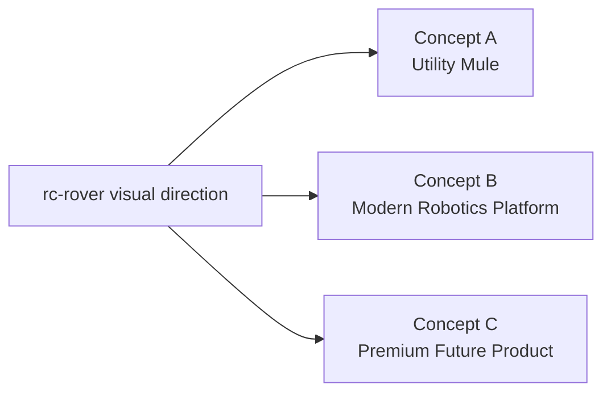
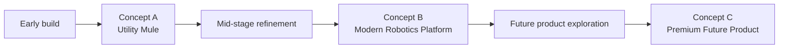

# rc-rover Concept Render Sheet

_Last updated: 2026-03-11_

This concept sheet defines the first visual directions for `rc-rover`. These are not final industrial designs. They are aesthetic and packaging directions meant to guide the future form of the rover once the mechanical architecture is frozen.

## Design goal

Create a rover that can eventually look:
- intentional
- modular
- technically credible
- visually distinct
- compatible with future sensor and payload growth

The underlying platform should still prioritize serviceability and experimentation.

---

## Visual family map



---

## Shared visual principles

All concept directions should preserve these qualities:
- low center of gravity
- clear front and rear identity
- visible purpose in the silhouette
- intentional sensor zones
- concealed or managed wiring
- modular mounting logic
- enough open access for maintenance

---

## Concept A - Utility Mule

### Personality
A straightforward engineering test platform with rugged proportions and visible functionality.

### Best for
- early prototype phases
- confidence during constant iteration
- easy service access
- “robotics mule” energy

### Visual cues
- exposed deck or semi-exposed side rails
- squared-off geometry
- visible fasteners acceptable
- bold bumper structure
- sensor pod mounted with obvious function
- wheels and mechanical stance are visually dominant

### Color and material direction
- matte black
- dark gray
- occasional safety accent color
- textured printed parts
- simple metal brackets acceptable

### Silhouette sketch

```text
Front/side character:
 ______________________
|  sensor pod          |
|______________________|
| electronics deck     |
|______________________|
 O                    O
```

### Strengths
- easiest to build honestly
- least likely to fight the hardware
- most realistic first prototype direction

### Risks
- can look unfinished if not curated
- may feel more “lab rig” than “product”

---

## Concept B - Modern Robotics Platform

### Personality
A clean, contemporary rover that still feels modular and engineering-forward.

### Best for
- middle phases of the project
- documented builds
- visual clarity without pretending to be consumer-finished

### Visual cues
- tapered upper shell surfaces
- clearer body volumes
- partially hidden wiring
- integrated front sensor brow
- clean side profile
- distinct top service panel

### Color and material direction
- charcoal shell
- satin black chassis
- muted metallic accents
- one restrained highlight color

### Silhouette sketch

```text
Front/side character:
      _____________
 ____/             \____
|   electronics / sensor  |
|_________________________|
   O                   O
```

### Strengths
- strong balance of prototype and polish
- visually credible for future presentations
- still compatible with modular upgrades

### Risks
- can become packaging-heavy too early
- must not reduce service access

---

## Concept C - Premium Future Product

### Personality
A polished forward-looking rover that hints at a true future product family.

### Best for
- later concept rendering
- product exploration
- future branch storytelling

### Visual cues
- cleaner shell continuity
- hidden fasteners where possible
- integrated sensor windows
- softer body transitions
- reduced visual clutter
- more intentional brand surfaces

### Color and material direction
- satin graphite
- matte black lower structure
- smoked sensor window treatment
- premium accent metal or muted color trim

### Silhouette sketch

```text
Front/side character:
      ________________
 ___ /                \ ___
|   integrated body shell   |
|___________________________|
    O                   O
```

### Strengths
- strongest for future product storytelling
- most emotionally compelling
- good long-term design target

### Risks
- wrong choice for the earliest build phase
- can conceal problems rather than solving them

---

## Comparative view

| Attribute | Concept A | Concept B | Concept C |
|---|---|---|---|
| Early prototype fit | High | Medium | Low |
| Serviceability | High | Medium-high | Medium |
| Visual polish | Medium | High | Very high |
| Build honesty | Very high | High | Medium |
| Product storytelling | Medium | High | Very high |

---

## Recommended visual strategy by phase



### Recommendation
Use the concepts as a **sequence**, not as mutually exclusive identities.

- **Phase 1 to Phase 4:** borrow mainly from **Concept A**
- **Phase 5 to Phase 10:** migrate toward **Concept B**
- **Phase 11 onward:** explore **Concept C**

That allows the rover to mature visually as its architecture matures.

---

## Orthographic design intent

### Front view priorities
- clear sensor zone
- stable stance
- confident width
- visible bumper or protective front structure

### Side view priorities
- low battery mass
- readable wheel placement
- enough deck volume for electronics
- a silhouette that suggests purpose, not randomness

### Top view priorities
- service access
- clean cable routing
- logical sensor mounting points
- future payload attachment area

---

## Early aesthetic do / do not

### Do
- keep the stance low and planted
- reserve a clear front sensor area
- keep upper surfaces simple
- use repeatable panel shapes
- think in terms of modules

### Do not
- over-style before the architecture is proven
- bury the wiring too early
- commit to a shell that blocks upgrades
- make it look like a finished consumer product before it behaves like a stable rover

---

## Render prompt starters

These are prompt-ready descriptions for future image generation once the physical envelope is frozen.

### Concept A prompt starter
“A compact modular differential-drive robotics rover prototype with exposed functional structure, low stance, large wheels, visible electronics deck, front sensor mount, matte black and dark gray materials, rugged engineering-test-platform aesthetic, realistic workshop render.”

### Concept B prompt starter
“A sleek modular ground rover with differential drive, low planted stance, integrated front sensor pod, clean electronics housing, satin charcoal and black finish, modern robotics platform aesthetic, realistic industrial design concept render.”

### Concept C prompt starter
“A premium future-product robotics rover with smooth integrated shell, hidden fasteners, dark graphite and matte black materials, smoked sensor window, refined modern robotics aesthetic, highly polished industrial design concept render.”

---

## Final recommendation

For the actual build path:
- **start visually in Concept A**
- **grow toward Concept B**
- **treat Concept C as the long-term aspiration**

That preserves honesty in the prototype while still giving the project a strong visual trajectory.
