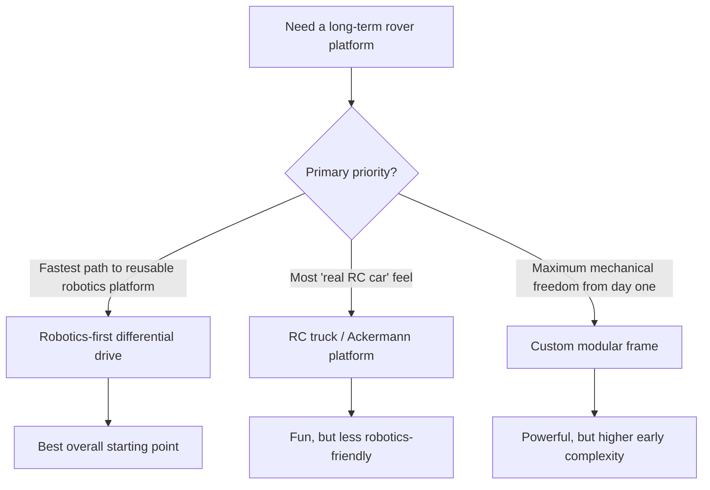
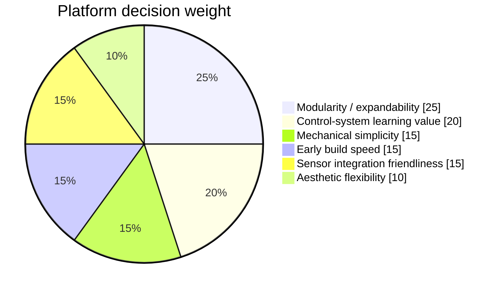
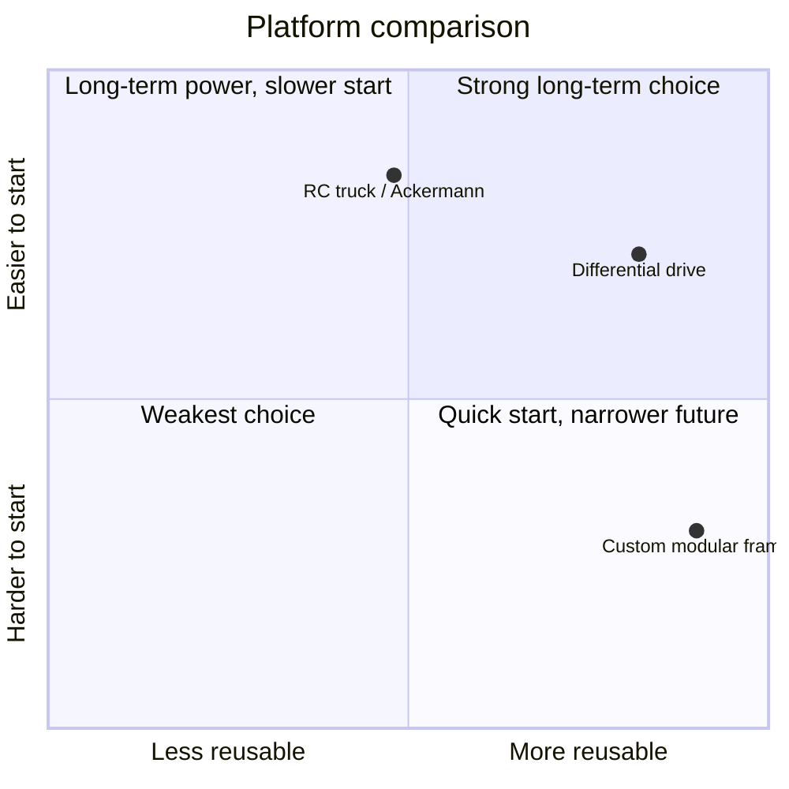

# rc-rover Platform Decision Matrix

_Last updated: 2026-03-11_

This document compares the most credible base-platform directions for `rc-rover` and recommends the best starting point for a long-lived learning platform.

## Decision objective

Pick a base platform that:
- is realistic to build early
- supports long-term reuse
- teaches the right skills
- does not become a dead-end chassis

## Option set

The three most credible starting directions are:

1. **Robotics-first differential drive**
2. **RC truck / Ackermann steering platform**
3. **Custom modular frame**

---

## Visual summary

---

## Recommendation

**Recommended starting point: Robotics-first differential drive**

Why this wins:
- easiest path into encoders, IMU, telemetry, and control loops
- easiest path into future semi-autonomy
- best platform reuse across many future experiments
- least likely to trap the project inside car-specific geometry

This does **not** mean the rover must look boring. It means the underlying mechanical architecture is better aligned with the long-term learning goals.

---

## Weighted decision criteria

### Criteria and weights

### Scoring scale
- **5** = excellent
- **4** = strong
- **3** = acceptable
- **2** = weak
- **1** = poor

## Score table

| Criteria | Weight | Differential drive | RC truck / Ackermann | Custom modular frame |
|---|---:|---:|---:|---:|
| Modularity / expandability | 25 | 5 | 3 | 5 |
| Control-system learning value | 20 | 5 | 3 | 5 |
| Mechanical simplicity | 15 | 4 | 4 | 2 |
| Early build speed | 15 | 4 | 5 | 2 |
| Sensor integration friendliness | 15 | 5 | 3 | 5 |
| Aesthetic flexibility | 10 | 4 | 4 | 5 |

## Weighted result

| Option | Weighted score |
|---|---:|
| Differential drive | 4.55 |
| RC truck / Ackermann | 3.65 |
| Custom modular frame | 4.00 |

---

## Option 1: Robotics-first differential drive

### Best fit for
- long-term platform reuse
- sensors and autonomy growth
- control-systems learning
- payload expansion later

### Strengths
- naturally supports wheel encoders and odometry
- turn-in-place capability is very useful for robotics
- simpler control model than Ackermann steering
- easier packaging for sensor mast, battery deck, and electronics
- well-aligned with future obstacle detection and navigation work

### Weaknesses
- may feel less like a traditional RC car
- can look utilitarian unless styling is intentional
- wheel scrub and traction behavior need consideration if skid-steer

### Recommended use
This should be the default path unless there is a strong emotional desire to prioritize “RC car feel” over robotics platform value.

---

## Option 2: RC truck / Ackermann platform

### Best fit for
- hobby RC feel
- faster initial fun
- automotive-style steering experiments

### Strengths
- familiar and exciting
- fast to get moving if a donor chassis is used
- visually intuitive as a “car”

### Weaknesses
- less convenient for robotics experiments
- packaging tends to be constrained by car geometry
- turn radius and steering geometry complicate later low-speed robotics behaviors
- less natural path into generic robotics payload work

### Recommended use
Good choice only if the emotional priority is a true RC-driving experience first.

---

## Option 3: Custom modular frame

### Best fit for
- maximum design freedom
- long-term tailored packaging
- a builder-first experience

### Strengths
- highest potential for optimized packaging
- strongest future-proofing if designed well
- best path for custom visual identity later

### Weaknesses
- highest early complexity
- easiest path to overbuilding
- slower route to first movement
- more fabrication burden before learning can start

### Recommended use
Best saved for a future revision, once the project has proven what it actually needs.

---

## Visual comparison map

---

## Recommended baseline

### Starting architecture
- **Drive layout:** differential drive
- **Controller:** ESP32-class microcontroller
- **Priority:** fast path to a reliable manual rover
- **Packaging goal:** open, modular, serviceable
- **Future compatibility:** telemetry, ToF sensor, encoders, IMU, later companion computer

### What this means in practice
The first rover should feel more like a **robotics mule** than a fully finished product. It should be easy to wire, easy to mount sensors on, and easy to refine.

---

## Decision gate

Freeze this platform direction before doing any of the following:
- buying motors
- selecting a motor driver
- designing mounts
- styling the shell
- laying out the electronics deck

---

## Final recommendation

**Proceed with a robotics-first differential-drive platform.**

It is the best balance of:
- early buildability
- control-systems learning
- sensor integration
- long-term expandability
- future product exploration
