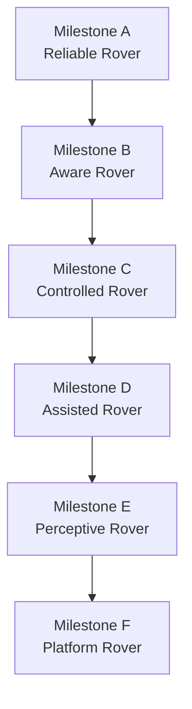
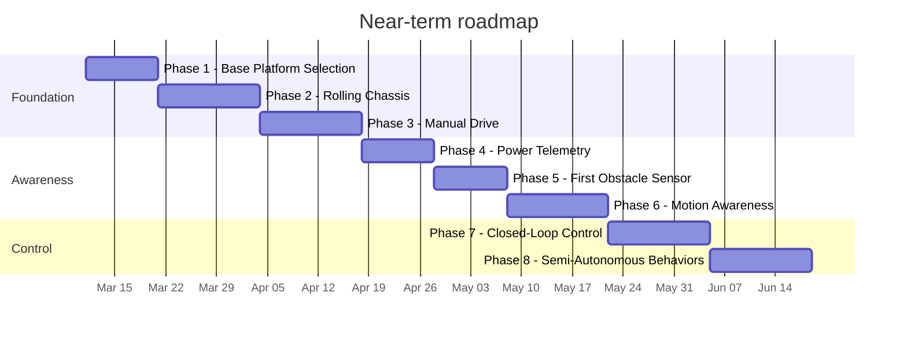

# rc-rover Roadmap

_Last updated: 2026-03-11_

This roadmap defines how `rc-rover` will grow from a simple manually controlled ground vehicle into a reusable robotics development platform. The project is intentionally staged so that each phase leaves behind a working machine, a clearer understanding of the system, and a documented foundation for the next step.

## North star

Build a modular rover platform that starts simple and grows over time into a capable learning and experimentation mule for:

- remote control
- power systems
- telemetry
- sensors
- motion estimation
- closed-loop control
- semi-autonomy
- advanced perception
- modular payloads
- refined industrial design

## Core roadmap rules

1. Every phase must leave behind a usable platform.
2. Each phase should have one primary learning objective.
3. The rover should evolve through upgrades, not repeated ground-up rebuilds.
4. Sensors should eventually influence behavior, not just produce data.
5. Architecture comes before aesthetics, but aesthetics should not be ignored forever.
6. If a concept can be tested cheaply and early, test it before overcommitting.

---

## Visual overview

```mermaid
flowchart LR
    A["Phase 0<br/>Project Operating System"] --> B["Phase 1<br/>Base Platform Selection"]
    B --> C["Phase 2<br/>Rolling Chassis"]
    C --> D["Phase 3<br/>Manual Drive"]
    D --> E["Phase 4<br/>Power Telemetry"]
    E --> F["Phase 5<br/>First Obstacle Sensor"]
    F --> G["Phase 6<br/>Motion Awareness"]
    G --> H["Phase 7<br/>Closed-Loop Control"]
    H --> I["Phase 8<br/>Semi-Autonomous Behaviors"]
    I --> J["Phase 9<br/>Advanced Perception"]
    J --> K["Phase 10<br/>Compute Upgrade"]
    K --> L["Phase 11<br/>Aesthetic Refinement"]
    L --> M["Phase 12<br/>Payload Ecosystem"]
    M --> N["Phase 13<br/>Productization Experiments"]
```

---

## Milestone ladder

### Milestone meanings

- **Milestone A - Reliable Rover**  
  The rover drives manually, stops safely, survives repeated tests, and has documented wiring and power setup.

- **Milestone B - Aware Rover**  
  The rover can report battery state and react to a simple obstacle sensor.

- **Milestone C - Controlled Rover**  
  The rover understands its own motion and can use feedback for better control.

- **Milestone D - Assisted Rover**  
  The rover can perform limited semi-autonomous behaviors safely and repeatably.

- **Milestone E - Perceptive Rover**  
  The rover can use richer sensing such as lidar or camera systems in meaningful ways.

- **Milestone F - Platform Rover**  
  The rover becomes a reusable robotics base with cleaner packaging, modular payloads, and possible product branches.

---

## Near-term sequence

This timeline is directional, not a fixed commitment. The project should move forward only when exit criteria are actually met.

---

## Phase 0 - Project operating system

### Objective
Create a repository and documentation system that can preserve project context across sessions.

### Focus
- documentation structure
- decisions log
- handoff process
- next-step tracking
- consistent templates

### Outputs
- `README.md`
- `AGENTS.md`
- `docs/PROJECT_STATE.md`
- `docs/NEXT_STEPS.md`
- `docs/DECISIONS.md`
- `docs/HANDOFF.md`
- `docs/ROADMAP.md`

### Exit criteria
A new session can recover the state of the project from the repository alone.

### Status
In progress and already substantially established.

---

## Phase 1 - Base platform selection

### Objective
Choose the base architecture that will support long-term reuse.

### Focus
- chassis type
- drive layout
- controller family
- voltage class
- manual control method
- modular packaging strategy

### Recommended direction
- robotics-first differential drive
- ESP32-class controller
- low-voltage DC platform
- flat or accessible electronics deck
- enough room for future sensors and wiring

### Outputs
- platform selection document
- stage 0/1 BOM
- stage 1 acceptance test
- first architecture sketch

### Exit criteria
All core parts for the first working rover can be selected and ordered with confidence.

---

## Phase 2 - Rolling chassis

### Objective
Build a durable base platform that can physically support future upgrades.

### Focus
- chassis/frame
- motor mounting
- wheel configuration
- battery placement
- switch and fuse placement
- electronics mounting
- wire routing

### Outputs
- assembled rolling chassis
- protected power path
- battery mounting solution
- controller mounting zone
- clean mechanical baseline

### Exit criteria
The rover can roll smoothly, support its own components, and present a stable platform for powered testing.

---

## Phase 3 - Manual drive

### Objective
Make the rover drive reliably under remote control.

### Focus
- motor control
- remote control link
- safe stop behavior
- firmware baseline
- repeated driving tests

### Outputs
- throttle and steering behavior
- failsafe stop
- basic status indication
- documented wiring and control path

### Exit criteria
The rover can:
- drive forward and reverse
- turn left and right predictably
- stop reliably
- survive repeated drive sessions without unsafe behavior

---

## Phase 4 - Power telemetry

### Objective
Make the rover aware of its own electrical condition.

### Focus
- battery voltage monitoring
- current sensing
- telemetry reporting
- calibration
- electrical diagnostics

### Outputs
- battery voltage readout
- current or power awareness
- basic operator telemetry
- logged or displayed power state

### Exit criteria
The rover can report meaningful battery state while operating.

---

## Phase 5 - First obstacle sensor

### Objective
Add the first environmental sensor and make it affect behavior.

### Focus
- distance sensing
- threshold logic
- warning behavior
- automatic stop behavior
- sensor mounting and protection

### Recommended first behavior
Front obstacle detection with warning and optional auto-stop.

### Exit criteria
The rover reliably detects an obstacle ahead and changes behavior because of that sensor input.

---

## Phase 6 - Motion awareness

### Objective
Make the rover understand its own movement.

### Focus
- wheel encoders
- IMU integration
- speed estimation
- heading estimation
- tilt or impact awareness

### Outputs
- measured speed
- estimated heading
- motion logs
- initial odometry understanding

### Exit criteria
The rover can report meaningful motion state rather than only raw sensor values.

---

## Phase 7 - Closed-loop control

### Objective
Use feedback to improve motion quality.

### Focus
- speed hold
- heading hold
- straight-line correction
- throttle smoothing
- repeatability

### Outputs
- smoother driving
- improved straight-line performance
- better repeatability across runs
- tuned control loops

### Exit criteria
Measured behavior is noticeably more consistent than open-loop manual control.

---

## Phase 8 - Semi-autonomous behaviors

### Objective
Add bounded autonomy without attempting full robotics too early.

### Candidate behaviors
- obstacle-aware creep mode
- wall following
- maintain-distance mode
- heading assist
- simple scripted motion
- return-to-orientation behavior

### Focus
- state machines
- arbitration between manual and assisted control
- safe behavior transitions

### Exit criteria
The rover can perform one or two semi-autonomous behaviors repeatably and safely.

---

## Phase 9 - Advanced perception

### Objective
Give the rover richer awareness of the environment.

### Candidate additions
- lidar
- camera
- depth camera
- fiducial marker detection
- simple mapping experiments

### Focus
- perception pipelines
- data rates
- synchronization
- sensor placement
- compute limitations

### Exit criteria
One advanced sensor is integrated in a way that materially changes what the rover can do.

---

## Phase 10 - Compute upgrade

### Objective
Introduce a higher-level compute layer only when the platform is ready for it.

### Candidate additions
- Raspberry Pi or similar companion computer
- richer logging
- higher-level software stack
- distributed control architecture
- optional ROS 2 later if justified

### Focus
- MCU vs companion computer responsibilities
- software modularity
- telemetry architecture
- process reliability

### Exit criteria
The rover has a stable low-level/high-level compute split that supports more advanced experiments.

---

## Phase 11 - Aesthetic refinement

### Objective
Make the platform look intentional and cohesive.

### Focus
- shell language
- wire hiding
- sensor pod design
- service panels
- color and material decisions
- mounting covers

### Outputs
- cleaner outer form
- intentional visual identity
- better packaging discipline

### Exit criteria
The rover looks cohesive without sacrificing serviceability or modularity.

---

## Phase 12 - Payload ecosystem

### Objective
Turn the rover into a reusable robotics mule for multiple missions.

### Candidate payloads
- sensor mast
- pan-tilt module
- lightweight manipulator experiment
- environmental sensing package
- towing module
- tray or delivery module
- advanced perception pod

### Focus
- swappable interfaces
- power budgeting
- center-of-gravity management
- mission-specific accessories

### Exit criteria
The rover can support swappable payload modules without major redesign.

---

## Phase 13 - Productization experiments

### Objective
Explore whether the platform suggests a real product direction.

### Candidate branches
- educational robotics kit
- sensor-learning platform
- premium RC robotics testbed
- compact inspection rover
- follow-me ground robot
- modular family-safe robotics platform

### Focus
- repeatability
- cost-down decisions
- user-facing simplification
- feature prioritization
- product branch identity

### Exit criteria
At least one future product direction can be described clearly and supported by the platform architecture.

---

## What we are explicitly not doing yet

To avoid scope creep, these should not be early-phase priorities:

- full autonomy
- camera-first development
- lidar-first development
- ROS-first development
- custom mobile app plus custom PCB plus custom chassis at the same time
- polished enclosure before drivetrain confidence
- expensive sensors before the base platform is reliable

---

## Immediate focus

The near-term path should remain:

1. Phase 1 - Base Platform Selection
2. Phase 2 - Rolling Chassis
3. Phase 3 - Manual Drive
4. Phase 4 - Power Telemetry
5. Phase 5 - First Obstacle Sensor
6. Phase 6 - Motion Awareness

This sequence gives the best balance of learning, momentum, and platform reuse.

---

## Current target milestone

### Milestone A - Reliable Rover

This is the first major gate.

The platform must:
- drive manually
- stop safely
- survive repeated tests
- have documented wiring
- report battery state
- preserve enough mounting and power headroom for future expansion

Until this milestone is met, later-phase complexity should be deferred.

---

## How to use this roadmap

Use this file for strategic direction, not as a daily task list.

For active execution:
- use `docs/NEXT_STEPS.md` for the action queue
- use `docs/PROJECT_STATE.md` for current status
- use `docs/DECISIONS.md` for committed decisions
- use `docs/HANDOFF.md` for fast session recovery

When the project changes direction materially, update this roadmap and record the reason in `docs/DECISIONS.md`.
