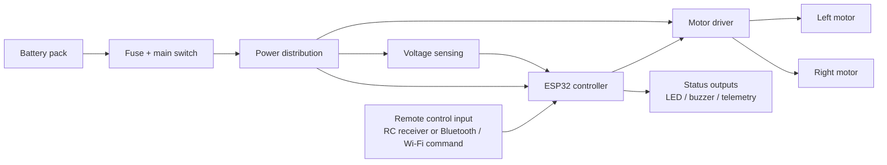
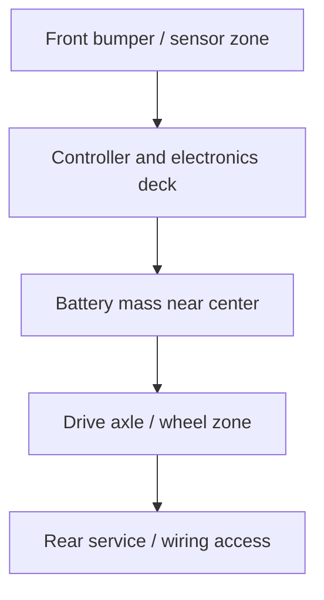
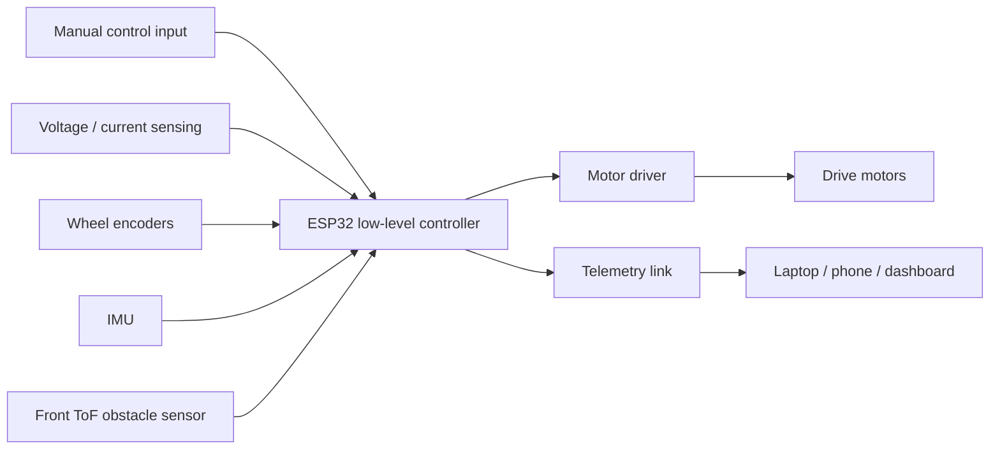
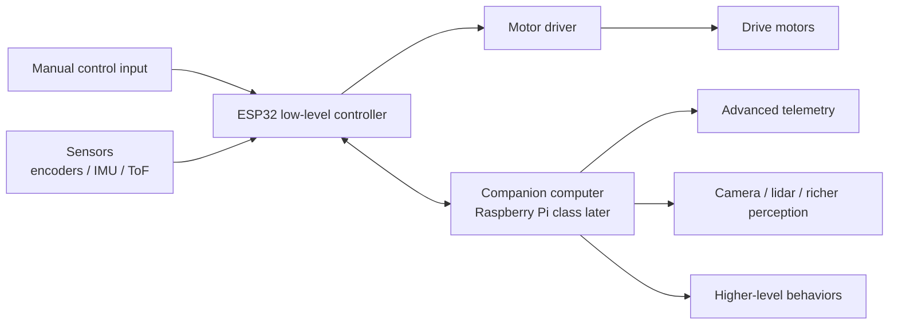
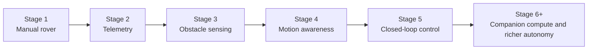

# rc-rover System Architecture Block Diagram

_Last updated: 2026-03-11_

This document defines the recommended system architecture for `rc-rover` across the early and mid-stage phases of the roadmap. The goal is to keep the platform simple early, while preserving a clean upgrade path into richer sensing and higher-level compute.

## Architecture principle

Use a **layered architecture**:

- keep real-time control close to the hardware
- keep future high-level intelligence separate from low-level drive control
- make upgrades additive instead of destructive

---

## Stage 1 system goal

Create a rover that:
- drives manually
- stops safely
- reports battery state
- can accept future sensor additions without redesigning everything

---

## Stage 1 block diagram



---

## Stage 1 architecture explanation

### Core control path
The **ESP32** is the first brain of the rover. It receives manual control input, converts it into motor commands, monitors key safety conditions, and reports basic telemetry.

### Power path
The battery should not feed everything directly without protection. The preferred path is:

```text
Battery -> Fuse -> Main switch -> Power distribution -> Motor driver / controller / sensors
```

This ensures the rover has a clear power isolation point and basic protection from wiring mistakes or short events.

### Safety path
At minimum, the rover should support:
- manual stop command
- loss-of-signal stop behavior
- main power kill through switch
- current-safe wiring and fuse sizing

---

## Stage 1 physical packaging view



### Packaging intent
- keep the front available for future obstacle sensing
- keep the battery low and central
- keep the controller accessible
- keep wiring paths visible and serviceable
- avoid burying the first build under cosmetic shells

---

## Stage 2 to Stage 6 expansion architecture

As the rover grows, the architecture should add capability in layers rather than replacing the Stage 1 foundation.



---

## Functional ownership map

| Layer | Owns |
|---|---|
| Human input layer | throttle, steering, mode selection |
| Low-level controller | real-time drive logic, failsafes, sensor polling |
| Drive layer | motor actuation |
| Power layer | battery, fuse, switch, regulated supply |
| Telemetry layer | status reporting, logging, diagnostics |
| Sensor layer | distance, motion, encoder, electrical state |

---

## Recommended interface split

### ESP32 should own
- motor outputs
- encoder reading
- IMU polling in early stages
- distance sensor polling
- safety timeouts
- battery voltage measurement
- basic telemetry publishing

### Future companion computer should own
- dashboards
- data logging
- advanced perception
- higher-level planning
- optional autonomy logic later

This split keeps the rover safe and drivable even if a future companion computer crashes or disconnects.

---

## Future companion-compute architecture

Only introduce this layer after the rover is already mechanically and electrically stable.



---

## Architecture evolution path



---

## Architecture constraints

The system should avoid these mistakes early:
- no camera-first architecture
- no ROS-first architecture
- no companion computer before low-level drive stability
- no over-custom power system before basic movement works
- no complex shell that blocks service access

---

## Recommended early hardware roles

### Minimum early stack
- **Battery:** power source
- **Fuse + switch:** protection and manual isolation
- **ESP32:** low-level controller
- **Motor driver:** power-stage interface to motors
- **Drive motors:** actuation
- **Voltage sense input:** battery awareness
- **Status LED / buzzer:** feedback and fault indication

### First add-on stack
- **ToF sensor:** obstacle awareness
- **Wheel encoders:** motion estimation
- **IMU:** heading, motion, tilt awareness

---

## Stage 1 acceptance architecture

The architecture is good enough for Stage 1 when:
- the rover can drive manually
- the rover can stop safely on command
- the rover handles power distribution cleanly
- the rover exposes enough electrical and physical access for the first sensors
- the wiring is documented well enough to reproduce

---

## Final recommendation

Use a **two-layer long-term architecture**:
1. **ESP32 low-level control layer** for anything safety-critical and real-time
2. **future companion compute layer** only when the rover is stable enough to justify it

That gives `rc-rover` the cleanest path from:
**simple manual rover -> sensed rover -> controlled rover -> richer robotics platform**
